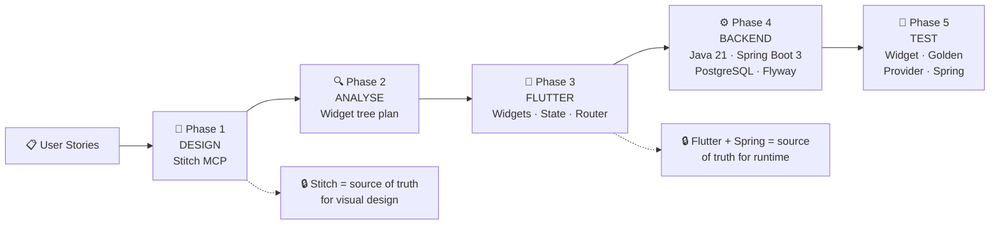
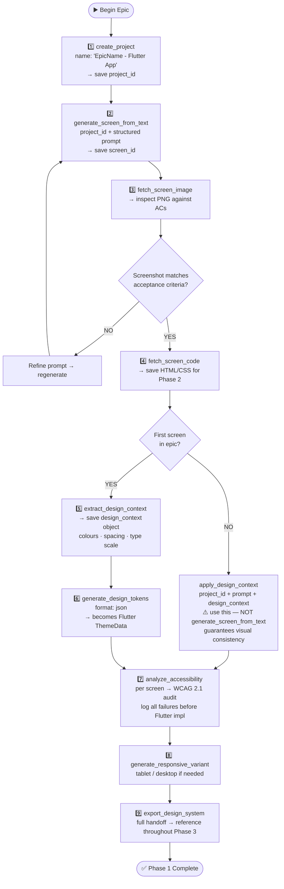
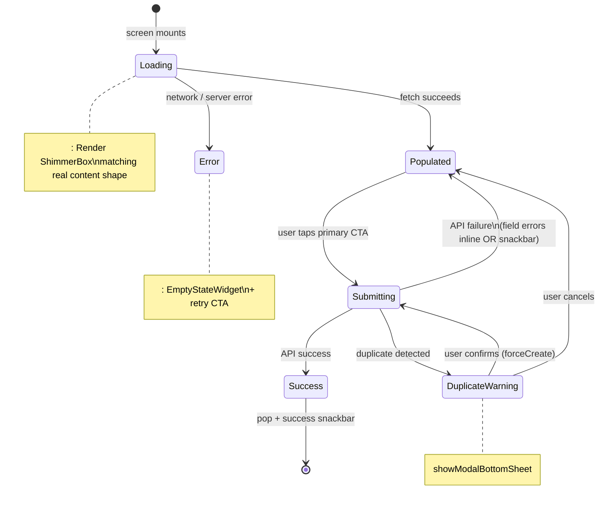
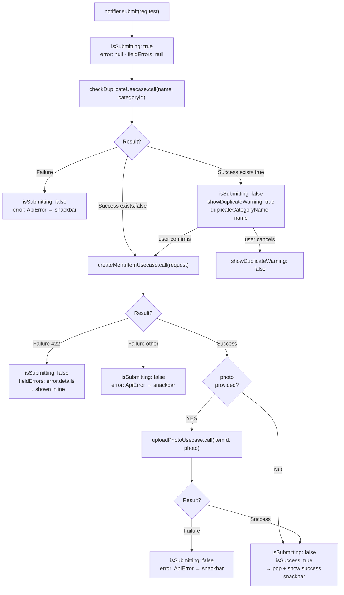
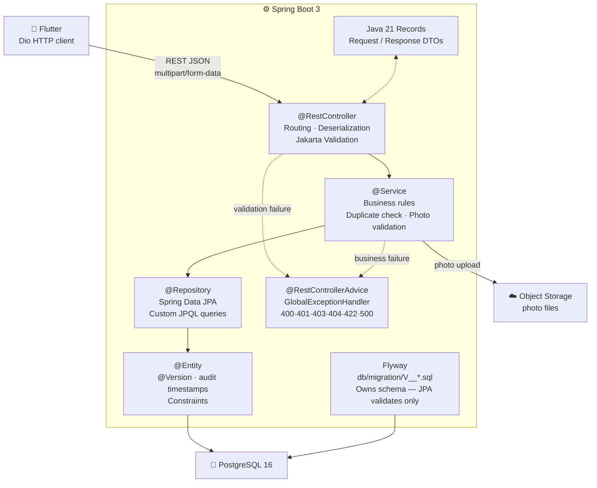

# Flutter Full-Stack Skill
## Stitch MCP → Flutter → Spring Boot 3 + PostgreSQL

---

## Pipeline Overview



---

## Tech Stack

| Layer | Technology |
|---|---|
| Design generation | Google Stitch API via `stitch-mcp-auto` MCP |
| Mobile / UI | Flutter 3.22+ (Dart 3.4+) |
| State management | Riverpod 2 (preferred) or BLoC 8 |
| Navigation | go_router 14+ |
| HTTP | Dio 5 + Retrofit |
| Local storage | flutter_secure_storage + Hive |
| Image loading | cached_network_image + shimmer |
| Backend language | Java 21 (LTS) |
| Backend framework | Spring Boot 3.3+ |
| Persistence | Spring Data JPA + Hibernate 6 + PostgreSQL 16 |
| Migration | Flyway |
| Validation | Jakarta Validation 3 |
| Build tool | Maven 3.9+ |
| Tests — Flutter | flutter_test + mocktail + golden_toolkit |
| Tests — Spring | JUnit 5 + Mockito 5 + Testcontainers + @WebMvcTest + @DataJpaTest |

---

# Phase 1 — Design with Stitch MCP

## Stitch MCP Workflow



## Stitch Prompt Template

```
Actor: [Role]
Goal: [What they want to accomplish on this screen]
Form factor: Mobile portrait, 390×844 px
Theme: Dark — background #0D0D1A, surface #1A1830, primary violet #7C5CBF, accent cyan #48CAE4
Typography: Display font for headings, clean sans-serif for body
States to show: [loading skeleton | filled | error inline | success feedback]
Data fields visible: [list every field name]
Actions: [list every button / tap target]
Navigation: [where back arrow goes, what tabs are present]
Design style: Modern, refined, dense but not crowded. Status badges use colour + text label.
```

## Phase 1 Output Artifacts

```
/design-artifacts/
├── stitch-project-id.txt
├── design-tokens.json
├── screens/
│   ├── [story-id]-[name].png
│   └── [story-id]-[name].html
├── design-context.json
├── design-system/
│   ├── tokens/
│   ├── components/
│   └── docs/
└── accessibility-reports/
    └── [story-id]-wcag.json
```

---

# Phase 2 — Analyse Stitch Output

## HTML → Flutter Widget Mapping

| Stitch HTML element | Flutter widget |
|---|---|
| `<div>` (flex column) | `Column` |
| `<div>` (flex row) | `Row` |
| `<div>` (grid) | `GridView` / `Wrap` |
| `<div>` (absolute positioned) | `Stack` + `Positioned` |
| `<div>` (scrollable) | `SingleChildScrollView` / `ListView` |
| `<header>` / `<nav>` | `AppBar` / custom `SliverAppBar` |
| `<footer>` | `BottomNavigationBar` / `NavigationBar` |
| `<button>` (primary) | `FilledButton` |
| `<button>` (secondary) | `OutlinedButton` |
| `<button>` (icon) | `IconButton` |
| `<input type="text">` | `TextField` with `InputDecoration` |
| `<select>` | `DropdownButtonFormField` |
| `` | `CachedNetworkImage` with `shimmerEffect` |
| `<card>` | `Card` with custom `shape` and `color` |
| `<badge>` | Custom `Container` + `Text` (inline) |
| `<modal>` / `<dialog>` | `showDialog` + `AlertDialog` |
| `<toast>` | `ScaffoldMessenger.showSnackBar` |
| `<skeleton>` placeholder | `Shimmer` widget from `shimmer` package |
| `<tab-bar>` | `TabBar` + `TabBarView` |
| `<chip>` | `FilterChip` / `ActionChip` |
| `<list-item>` | `ListTile` |
| `<avatar>` | `CircleAvatar` |
| `<progress>` | `LinearProgressIndicator` / `CircularProgressIndicator` |
| `<fab>` | `FloatingActionButton` |

## Design Token → ThemeData Mapping

| Stitch token | Flutter ThemeData |
|---|---|
| `colors.primary` | `colorScheme.primary` |
| `colors.background` | `scaffoldBackgroundColor` |
| `colors.surface` | `colorScheme.surface` |
| `colors.error` | `colorScheme.error` |
| `typography.display.size` | `TextTheme.displayLarge.fontSize` |
| `spacing.sm` | `8.0` logical pixels |
| `borderRadius.card` | `BorderRadius.circular(N)` |

## Component Inventory (example — Create Menu Item)

```
Screen: Create Menu Item
Components:
  ├── AppBar with back arrow + title                → AppBarWidget (reusable)
  ├── Text field — Item Name (with char counter)   → LabeledTextField (reusable)
  ├── Text field — Base Price ($ prefix)           → CurrencyTextField (reusable)
  ├── Dropdown — Category                          → CategoryDropdown
  ├── Photo upload zone (dashed border)            → PhotoUploadZone
  ├── Image preview with shimmer                   → CachedImageWithShimmer (reusable)
  ├── Status badge (DRAFT, PUBLISHED)              → StatusBadge (reusable)
  ├── Inline error text                            → FieldErrorText (reusable)
  ├── Primary button — Save as Draft               → FilledButton (themed)
  └── Duplicate warning bottom sheet              → DuplicateWarningSheet
```

---

# Phase 3 — Flutter Implementation

## Project Structure

```
lib/
├── core/
│   ├── theme/
│   │   ├── app_theme.dart
│   │   ├── app_colors.dart
│   │   ├── app_text_styles.dart
│   │   └── app_spacing.dart
│   ├── router/
│   │   └── app_router.dart
│   ├── network/
│   │   ├── api_client.dart
│   │   ├── api_error.dart
│   │   └── result.dart
│   ├── widgets/
│   │   ├── app_bar_widget.dart
│   │   ├── labeled_text_field.dart
│   │   ├── currency_text_field.dart
│   │   ├── status_badge.dart
│   │   ├── field_error_text.dart
│   │   ├── cached_image_with_shimmer.dart
│   │   ├── shimmer_placeholder.dart
│   │   ├── empty_state_widget.dart
│   │   └── error_snack_bar.dart
│   └── utils/
│       ├── currency_formatter.dart
│       └── date_formatter.dart
└── features/
    └── [feature_name]/
        ├── data/
        │   ├── models/          ← freezed DTOs
        │   ├── repositories/    ← impl
        │   └── datasources/     ← remote
        ├── domain/
        │   ├── entities/
        │   ├── repositories/    ← abstract
        │   └── usecases/
        └── presentation/
            ├── providers/       ← Riverpod
            ├── screens/
            └── widgets/         ← feature-specific
```

## Screen State Machine



## Riverpod State Flow



## AppColors — from Stitch Tokens

```dart
// lib/core/theme/app_colors.dart
// Generated from Stitch design-tokens.json — do not edit manually.
import 'package:flutter/material.dart';

class AppColors {
  AppColors._();
  static const Color background   = Color(0xFF0D0D1A); // colors.background
  static const Color surface      = Color(0xFF1A1830); // colors.surface
  static const Color surfaceAlt   = Color(0xFF231F3D); // colors.surfaceVariant
  static const Color primary      = Color(0xFF7C5CBF); // colors.primary
  static const Color primaryLight = Color(0xFF9D7DE0); // colors.primaryContainer
  static const Color secondary    = Color(0xFF48CAE4); // colors.secondary
  static const Color error        = Color(0xFFF87171); // colors.error
  static const Color success      = Color(0xFF34D399); // colors.success
  static const Color warning      = Color(0xFFFBBF24); // colors.warning
  static const Color foreground   = Color(0xFFF0EEFF); // colors.onSurface
  static const Color muted        = Color(0xFF7A7599); // colors.muted
  static const Color border       = Color(0xFF2A2640); // colors.border
}
```

## AppSpacing

```dart
// lib/core/theme/app_spacing.dart
class AppSpacing {
  AppSpacing._();
  static const double xs   = 4.0;
  static const double sm   = 8.0;
  static const double md   = 16.0;
  static const double lg   = 24.0;
  static const double xl   = 32.0;
  static const double xxl  = 48.0;
  static const double xxxl = 64.0;
  static const double radiusSm   = 8.0;
  static const double radiusMd   = 12.0;
  static const double radiusLg   = 16.0;
  static const double radiusXl   = 24.0;
  static const double radiusFull = 999.0;
}
```

## AppTheme

```dart
// lib/core/theme/app_theme.dart
import 'package:flutter/material.dart';
import 'app_colors.dart';
import 'app_spacing.dart';

class AppTheme {
  AppTheme._();

  static ThemeData get darkTheme => ThemeData(
    useMaterial3: true,
    brightness: Brightness.dark,
    scaffoldBackgroundColor: AppColors.background,
    colorScheme: const ColorScheme.dark(
      primary:    AppColors.primary,
      onPrimary:  AppColors.foreground,
      secondary:  AppColors.secondary,
      onSecondary:AppColors.background,
      surface:    AppColors.surface,
      onSurface:  AppColors.foreground,
      error:      AppColors.error,
      onError:    AppColors.foreground,
      outline:    AppColors.border,
    ),
    textTheme: const TextTheme(
      displayLarge:  TextStyle(fontSize: 32, fontWeight: FontWeight.w800, color: AppColors.foreground, fontFamily: 'Syne'),
      displayMedium: TextStyle(fontSize: 26, fontWeight: FontWeight.w700, color: AppColors.foreground, fontFamily: 'Syne'),
      headlineMedium:TextStyle(fontSize: 22, fontWeight: FontWeight.w700, color: AppColors.foreground, fontFamily: 'Syne'),
      titleLarge:    TextStyle(fontSize: 18, fontWeight: FontWeight.w600, color: AppColors.foreground),
      titleMedium:   TextStyle(fontSize: 16, fontWeight: FontWeight.w500, color: AppColors.foreground),
      bodyLarge:     TextStyle(fontSize: 16, fontWeight: FontWeight.w400, color: AppColors.foreground),
      bodyMedium:    TextStyle(fontSize: 14, fontWeight: FontWeight.w400, color: AppColors.foreground),
      bodySmall:     TextStyle(fontSize: 12, fontWeight: FontWeight.w400, color: AppColors.muted),
      labelLarge:    TextStyle(fontSize: 14, fontWeight: FontWeight.w600, color: AppColors.foreground),
    ),
    appBarTheme: const AppBarTheme(
      backgroundColor:        AppColors.surface,
      surfaceTintColor:       Colors.transparent,
      elevation:              0,
      scrolledUnderElevation: 1,
      shadowColor:            AppColors.border,
      titleTextStyle:         TextStyle(fontSize: 18, fontWeight: FontWeight.w700, color: AppColors.foreground, fontFamily: 'Syne'),
      iconTheme:              IconThemeData(color: AppColors.foreground),
    ),
    cardTheme: CardThemeData(
      color:            AppColors.surface,
      surfaceTintColor: Colors.transparent,
      elevation:        0,
      shape:            RoundedRectangleBorder(
        borderRadius: BorderRadius.circular(AppSpacing.radiusLg),
        side:         const BorderSide(color: AppColors.border),
      ),
    ),
    inputDecorationTheme: InputDecorationTheme(
      filled:         true,
      fillColor:      AppColors.background,
      contentPadding: const EdgeInsets.symmetric(horizontal: 16, vertical: 14),
      border:         OutlineInputBorder(borderRadius: BorderRadius.circular(AppSpacing.radiusMd), borderSide: const BorderSide(color: AppColors.border)),
      enabledBorder:  OutlineInputBorder(borderRadius: BorderRadius.circular(AppSpacing.radiusMd), borderSide: const BorderSide(color: AppColors.border)),
      focusedBorder:  OutlineInputBorder(borderRadius: BorderRadius.circular(AppSpacing.radiusMd), borderSide: const BorderSide(color: AppColors.primary, width: 2)),
      errorBorder:    OutlineInputBorder(borderRadius: BorderRadius.circular(AppSpacing.radiusMd), borderSide: const BorderSide(color: AppColors.error)),
      hintStyle:      const TextStyle(color: AppColors.muted, fontSize: 14),
      labelStyle:     const TextStyle(color: AppColors.muted, fontSize: 14),
      errorStyle:     const TextStyle(color: AppColors.error, fontSize: 12),
    ),
    filledButtonTheme: FilledButtonThemeData(
      style: FilledButton.styleFrom(
        backgroundColor: AppColors.primary,
        foregroundColor: AppColors.foreground,
        minimumSize:     const Size(double.infinity, 50),
        shape:           RoundedRectangleBorder(borderRadius: BorderRadius.circular(AppSpacing.radiusMd)),
        textStyle:       const TextStyle(fontSize: 15, fontWeight: FontWeight.w600),
      ),
    ),
    outlinedButtonTheme: OutlinedButtonThemeData(
      style: OutlinedButton.styleFrom(
        foregroundColor: AppColors.foreground,
        minimumSize:     const Size(double.infinity, 50),
        side:            const BorderSide(color: AppColors.border),
        shape:           RoundedRectangleBorder(borderRadius: BorderRadius.circular(AppSpacing.radiusMd)),
      ),
    ),
    snackBarTheme: SnackBarThemeData(
      backgroundColor:  AppColors.surface,
      contentTextStyle: const TextStyle(color: AppColors.foreground, fontSize: 14),
      shape:            RoundedRectangleBorder(
        borderRadius: BorderRadius.circular(AppSpacing.radiusMd),
        side:         const BorderSide(color: AppColors.border),
      ),
      behavior: SnackBarBehavior.floating,
    ),
  );
}
```

## Result\<T\> — Sealed Type

```dart
// lib/core/network/result.dart
// Every API call returns Result<T> — never throws.
sealed class Result<T> { const Result(); }

final class Success<T> extends Result<T> {
  final T data;
  const Success(this.data);
}

final class Failure<T> extends Result<T> {
  final ApiError error;
  const Failure(this.error);
}
```

## ApiError

```dart
// lib/core/network/api_error.dart
class ApiError {
  final int status;
  final String message;
  final Map<String, List<String>>? details; // field-level from 422

  const ApiError({required this.status, required this.message, this.details});

  factory ApiError.fromDioError(DioException e) {
    final data = e.response?.data as Map<String, dynamic>?;
    return ApiError(
      status:  e.response?.statusCode ?? 0,
      message: data?['message'] ?? _httpMessage(e.response?.statusCode),
      details: (data?['details'] as Map<String, dynamic>?)?.map(
        (k, v) => MapEntry(k, List<String>.from(v as List)),
      ),
    );
  }

  factory ApiError.network() =>
      const ApiError(status: 0, message: 'Network error — check your connection.');

  static String _httpMessage(int? status) => switch (status) {
    400 => 'Invalid request.',
    401 => 'Sign in to continue.',
    403 => 'Permission denied.',
    404 => 'Not found.',
    422 => 'Validation failed.',
    500 => 'Server error — please try again later.',
    _   => 'Unexpected error.',
  };
}
```

## ApiClient

```dart
// lib/core/network/api_client.dart
class ApiClient {
  late final Dio _dio;

  ApiClient({required String baseUrl}) {
    _dio = Dio(BaseOptions(
      baseUrl:        baseUrl,
      connectTimeout: const Duration(seconds: 10),
      receiveTimeout: const Duration(seconds: 30),
      headers:        {'Content-Type': 'application/json'},
    ));
  }

  Future<Result<T>> get<T>(String path, {Map<String, dynamic>? queryParams, required T Function(dynamic) fromJson}) async {
    try {
      final res = await _dio.get(path, queryParameters: queryParams);
      return Success(fromJson(res.data));
    } on DioException catch (e) { return Failure(ApiError.fromDioError(e)); }
    catch (_)                   { return Failure(ApiError.network()); }
  }

  Future<Result<T>> post<T>(String path, {dynamic body, required T Function(dynamic) fromJson}) async {
    try {
      final res = await _dio.post(path, data: body);
      return Success(fromJson(res.data));
    } on DioException catch (e) { return Failure(ApiError.fromDioError(e)); }
    catch (_)                   { return Failure(ApiError.network()); }
  }

  Future<Result<T>> postMultipart<T>(String path, {required FormData formData, required T Function(dynamic) fromJson}) async {
    try {
      final res = await _dio.post(path, data: formData,
        options: Options(headers: {'Content-Type': 'multipart/form-data'}));
      return Success(fromJson(res.data));
    } on DioException catch (e) { return Failure(ApiError.fromDioError(e)); }
    catch (_)                   { return Failure(ApiError.network()); }
  }
}
```

## go_router Config

```dart
// lib/core/router/app_router.dart
class AppRouter {
  static final GoRouter router = GoRouter(
    initialLocation: '/menu/items',
    routes: [
      GoRoute(
        path: '/menu/items',
        name: 'menuItemList',
        builder: (ctx, state) => const MenuItemListScreen(),
        routes: [
          GoRoute(path: 'new',  name: 'createMenuItem',  builder: (ctx, state) => const CreateMenuItemScreen()),
          GoRoute(
            path: ':id', name: 'menuItemDetail',
            builder: (ctx, state) => MenuItemDetailScreen(id: state.pathParameters['id']!),
            routes: [
              GoRoute(path: 'edit', name: 'editMenuItem',
                builder: (ctx, state) => EditMenuItemScreen(id: state.pathParameters['id']!)),
            ],
          ),
        ],
      ),
    ],
  );
}
```

## Core Widgets

### CachedImageWithShimmer

```dart
// lib/core/widgets/cached_image_with_shimmer.dart
class CachedImageWithShimmer extends StatelessWidget {
  final String? imageUrl;
  final double? width;
  final double? height;
  final BoxFit fit;
  final double borderRadius;

  const CachedImageWithShimmer({super.key, this.imageUrl, this.width, this.height,
    this.fit = BoxFit.cover, this.borderRadius = AppSpacing.radiusLg});

  @override
  Widget build(BuildContext context) {
    if (imageUrl == null || imageUrl!.isEmpty) {
      return _NoImage(width: width, height: height, radius: borderRadius);
    }
    return ClipRRect(
      borderRadius: BorderRadius.circular(borderRadius),
      child: CachedNetworkImage(
        imageUrl: imageUrl!, width: width, height: height, fit: fit,
        placeholder: (ctx, url) => _Shimmer(width: width, height: height),
        errorWidget: (ctx, url, err) => _NoImage(width: width, height: height, radius: borderRadius),
      ),
    );
  }
}

class _Shimmer extends StatelessWidget {
  final double? width; final double? height;
  const _Shimmer({this.width, this.height});
  @override
  Widget build(BuildContext context) => Shimmer.fromColors(
    baseColor: AppColors.surfaceAlt, highlightColor: AppColors.border,
    child: Container(width: width ?? double.infinity, height: height ?? double.infinity, color: AppColors.surfaceAlt),
  );
}

class _NoImage extends StatelessWidget {
  final double? width; final double? height; final double radius;
  const _NoImage({this.width, this.height, required this.radius});
  @override
  Widget build(BuildContext context) => Container(
    width: width ?? double.infinity, height: height ?? double.infinity,
    decoration: BoxDecoration(
      color: AppColors.surface, borderRadius: BorderRadius.circular(radius),
      border: Border.all(color: AppColors.border),
    ),
    child: const Column(mainAxisAlignment: MainAxisAlignment.center, children: [
      Icon(Icons.image_not_supported_outlined, color: AppColors.muted, size: 32),
      SizedBox(height: 8),
      Text('No image', style: TextStyle(color: AppColors.muted, fontSize: 12)),
    ]),
  );
}
```

### StatusBadge

```dart
// lib/core/widgets/status_badge.dart
// Colour + text label — never colour alone (WCAG accessibility rule).
enum ItemStatus { draft, published, archived }

class StatusBadge extends StatelessWidget {
  final ItemStatus status;
  const StatusBadge({super.key, required this.status});

  @override
  Widget build(BuildContext context) {
    final (label, fg, bg) = switch (status) {
      ItemStatus.draft     => ('Draft',    AppColors.warning, AppColors.warning.withOpacity(0.15)),
      ItemStatus.published => ('Live',     AppColors.success, AppColors.success.withOpacity(0.15)),
      ItemStatus.archived  => ('Archived', AppColors.muted,   AppColors.border),
    };
    return Container(
      padding: const EdgeInsets.symmetric(horizontal: 10, vertical: 4),
      decoration: BoxDecoration(
        color: bg, borderRadius: BorderRadius.circular(AppSpacing.radiusFull),
        border: Border.all(color: fg.withOpacity(0.4)),
      ),
      child: Text(label, style: TextStyle(color: fg, fontSize: 11, fontWeight: FontWeight.w600, letterSpacing: 0.4)),
    );
  }
}
```

### ShimmerBox

```dart
// lib/core/widgets/shimmer_placeholder.dart
// Generic shimmer rectangle. Compose into feature-specific skeletons.
class ShimmerBox extends StatelessWidget {
  final double? width; final double? height;
  final double radius;
  const ShimmerBox({super.key, this.width, this.height, this.radius = AppSpacing.radiusMd});

  @override
  Widget build(BuildContext context) => Shimmer.fromColors(
    baseColor: AppColors.surfaceAlt, highlightColor: AppColors.border,
    child: Container(
      width: width, height: height ?? 16,
      decoration: BoxDecoration(color: AppColors.surfaceAlt, borderRadius: BorderRadius.circular(radius)),
    ),
  );
}
```

## Feature — Create Menu Item (US-1.1)

### Riverpod Provider

```dart
// lib/features/menu_items/presentation/providers/create_menu_item_provider.dart
@freezed
class CreateMenuItemState with _$CreateMenuItemState {
  const factory CreateMenuItemState({
    @Default(false) bool isSubmitting,
    @Default(false) bool showDuplicateWarning,
    String?  duplicateCategoryName,
    ApiError? error,
    Map<String, List<String>>? fieldErrors,
    @Default(false) bool isSuccess,
  }) = _CreateMenuItemState;
}

class CreateMenuItemNotifier extends AsyncNotifier<CreateMenuItemState> {
  @override
  Future<CreateMenuItemState> build() async => const CreateMenuItemState();

  Future<void> submit(CreateMenuItemRequest request, {bool forceCreate = false}) async {
    state = AsyncData(state.requireValue.copyWith(isSubmitting: true, error: null, fieldErrors: null));

    if (!forceCreate) {
      final dupResult = await ref.read(checkDuplicateUsecaseProvider).call(request.name, request.categoryId);
      if (dupResult case Failure(:final error)) {
        state = AsyncData(state.requireValue.copyWith(isSubmitting: false, error: error)); return;
      }
      if (dupResult case Success(:final data) when data.exists) {
        state = AsyncData(state.requireValue.copyWith(
          isSubmitting: false, showDuplicateWarning: true, duplicateCategoryName: data.categoryName,
        )); return;
      }
    }

    final createResult = await ref.read(createMenuItemUsecaseProvider).call(request);
    if (createResult case Failure(:final error)) {
      state = AsyncData(state.requireValue.copyWith(
        isSubmitting: false, error: error, fieldErrors: error.details,
      )); return;
    }

    final itemId = (createResult as Success).data.id;
    if (request.photo != null) {
      final photoResult = await ref.read(uploadPhotoUsecaseProvider).call(itemId, request.photo!);
      if (photoResult case Failure(:final error)) {
        state = AsyncData(state.requireValue.copyWith(isSubmitting: false, error: error)); return;
      }
    }

    state = AsyncData(state.requireValue.copyWith(isSubmitting: false, isSuccess: true));
  }

  void dismissDuplicateWarning() => state = AsyncData(
    state.requireValue.copyWith(showDuplicateWarning: false, duplicateCategoryName: null));

  void confirmDuplicate(CreateMenuItemRequest request) {
    state = AsyncData(state.requireValue.copyWith(showDuplicateWarning: false));
    submit(request, forceCreate: true);
  }
}

final createMenuItemProvider =
    AsyncNotifierProvider<CreateMenuItemNotifier, CreateMenuItemState>(CreateMenuItemNotifier.new);
```

### Screen

```dart
// lib/features/menu_items/presentation/screens/create_menu_item_screen.dart
class CreateMenuItemScreen extends ConsumerStatefulWidget {
  const CreateMenuItemScreen({super.key});
  @override
  ConsumerState<CreateMenuItemScreen> createState() => _CreateMenuItemScreenState();
}

class _CreateMenuItemScreenState extends ConsumerState<CreateMenuItemScreen> {
  final _formKey  = GlobalKey<FormState>();
  final _nameCtr  = TextEditingController();
  final _priceCtr = TextEditingController();
  int?   _categoryId;
  File?  _photoFile;

  String? _validateName(String? v) {
    if (v == null || v.trim().isEmpty) return 'Name is required.';
    if (v.length > 60)                return 'Name must be 60 characters or fewer.';
    return null;
  }

  String? _validatePrice(String? v) {
    if (v == null || v.trim().isEmpty) return 'Base price is required.';
    final n = double.tryParse(v);
    if (n == null) return 'Enter a valid price.';
    if (n < 0)     return 'Price must be \$0.00 or greater.';
    return null;
  }

  Future<void> _pickPhoto() async {
    final xFile = await ImagePicker().pickImage(source: ImageSource.gallery, imageQuality: 90);
    if (xFile == null) return;
    final file = File(xFile.path);
    if (await file.length() > 5 * 1024 * 1024) {
      if (mounted) ScaffoldMessenger.of(context).showSnackBar(
        const SnackBar(content: Text('Photo exceeds 5 MB limit.'), backgroundColor: AppColors.error));
      return;
    }
    final ext = xFile.path.toLowerCase();
    if (!ext.endsWith('.jpg') && !ext.endsWith('.jpeg') && !ext.endsWith('.png')) {
      if (mounted) ScaffoldMessenger.of(context).showSnackBar(
        const SnackBar(content: Text('Only JPEG and PNG files are accepted.'), backgroundColor: AppColors.error));
      return;
    }
    setState(() => _photoFile = file);
  }

  Future<void> _submit() async {
    if (!_formKey.currentState!.validate()) return;
    await ref.read(createMenuItemProvider.notifier).submit(CreateMenuItemRequest(
      name: _nameCtr.text.trim(), basePrice: double.parse(_priceCtr.text.trim()),
      categoryId: _categoryId!, photo: _photoFile,
    ));
  }

  @override
  void initState() {
    super.initState();
    WidgetsBinding.instance.addPostFrameCallback((_) {
      ref.listenManual(createMenuItemProvider, (prev, next) {
        final s = next.requireValue;
        if (s.isSuccess) { ScaffoldMessenger.of(context).showSnackBar(
          const SnackBar(content: Text('Item saved as Draft.'), backgroundColor: AppColors.success));
          context.pop(); }
        if (s.error != null && s.fieldErrors == null) ScaffoldMessenger.of(context).showSnackBar(
          SnackBar(content: Text(s.error!.message), backgroundColor: AppColors.error));
        if (s.showDuplicateWarning) showModalBottomSheet(
          context: context, backgroundColor: AppColors.surface,
          shape: const RoundedRectangleBorder(borderRadius: BorderRadius.vertical(top: Radius.circular(AppSpacing.radiusXl))),
          builder: (_) => DuplicateWarningSheet(
            categoryName: s.duplicateCategoryName ?? '',
            onCancel: () { Navigator.pop(context); ref.read(createMenuItemProvider.notifier).dismissDuplicateWarning(); },
            onConfirm: () { Navigator.pop(context);
              ref.read(createMenuItemProvider.notifier).confirmDuplicate(CreateMenuItemRequest(
                name: _nameCtr.text.trim(), basePrice: double.parse(_priceCtr.text.trim()),
                categoryId: _categoryId!, photo: _photoFile)); },
          ),
        );
      });
    });
  }

  @override
  void dispose() { _nameCtr.dispose(); _priceCtr.dispose(); super.dispose(); }

  @override
  Widget build(BuildContext context) {
    final state       = ref.watch(createMenuItemProvider).requireValue;
    final fieldErrors = state.fieldErrors ?? {};

    return Scaffold(
      appBar: AppBar(
        title: const Text('New Menu Item'),
        leading: IconButton(icon: const Icon(Icons.arrow_back_ios_new_rounded), onPressed: () => context.pop()),
        actions: [Padding(padding: const EdgeInsets.only(right: AppSpacing.md), child: StatusBadge(status: ItemStatus.draft))],
      ),
      body: Form(
        key: _formKey,
        child: ListView(padding: const EdgeInsets.all(AppSpacing.md), children: [
          // Info banner
          Container(
            padding: const EdgeInsets.all(AppSpacing.md),
            decoration: BoxDecoration(
              color: AppColors.warning.withOpacity(0.1),
              borderRadius: BorderRadius.circular(AppSpacing.radiusMd),
              border: Border.all(color: AppColors.warning.withOpacity(0.3)),
            ),
            child: const Row(children: [
              Icon(Icons.info_outline_rounded, color: AppColors.warning, size: 18),
              SizedBox(width: 8),
              Expanded(child: Text('New items are saved as Draft and won\'t appear on the live POS grid until published.',
                style: TextStyle(color: AppColors.warning, fontSize: 13))),
            ]),
          ),
          const SizedBox(height: AppSpacing.lg),
          _Label('Item Name', required: true),
          TextFormField(controller: _nameCtr, maxLength: 60, validator: _validateName,
            decoration: InputDecoration(hintText: 'e.g. Truffle Burger', errorText: fieldErrors['name']?.first)),
          const SizedBox(height: AppSpacing.md),
          _Label('Base Price', required: true),
          TextFormField(controller: _priceCtr,
            keyboardType: const TextInputType.numberWithOptions(decimal: true),
            validator: _validatePrice,
            decoration: InputDecoration(prefixText: '\$ ', hintText: '0.00', errorText: fieldErrors['basePrice']?.first)),
          const SizedBox(height: AppSpacing.md),
          _Label('Category', required: true),
          CategoryDropdown(value: _categoryId,
            errorText: _categoryId == null && fieldErrors.containsKey('categoryId') ? fieldErrors['categoryId']!.first : null,
            onChanged: (id) => setState(() => _categoryId = id)),
          const SizedBox(height: AppSpacing.lg),
          _Label('Photo', subtitle: 'JPEG or PNG, max 5 MB'),
          PhotoUploadZone(file: _photoFile, onTap: _pickPhoto, onRemove: () => setState(() => _photoFile = null)),
          const SizedBox(height: 100),
        ]),
      ),
      bottomNavigationBar: SafeArea(
        child: Container(
          padding: const EdgeInsets.fromLTRB(AppSpacing.md, AppSpacing.sm, AppSpacing.md, AppSpacing.md),
          decoration: const BoxDecoration(color: AppColors.surface, border: Border(top: BorderSide(color: AppColors.border))),
          child: Row(children: [
            Expanded(child: OutlinedButton(onPressed: state.isSubmitting ? null : () => context.pop(), child: const Text('Cancel'))),
            const SizedBox(width: AppSpacing.sm),
            Expanded(flex: 2, child: FilledButton(
              onPressed: state.isSubmitting ? null : _submit,
              child: state.isSubmitting
                  ? const SizedBox(height: 20, width: 20, child: CircularProgressIndicator(strokeWidth: 2,
                      valueColor: AlwaysStoppedAnimation(AppColors.foreground)))
                  : const Text('Save as Draft'),
            )),
          ]),
        ),
      ),
    );
  }
}

class _Label extends StatelessWidget {
  final String text; final String? subtitle; final bool required;
  const _Label(this.text, {this.subtitle, this.required = false});
  @override
  Widget build(BuildContext context) => Padding(
    padding: const EdgeInsets.only(bottom: 6),
    child: Row(children: [
      Text(text, style: const TextStyle(fontSize: 14, fontWeight: FontWeight.w500, color: AppColors.foreground)),
      if (required) const Text(' *', style: TextStyle(color: AppColors.error)),
      if (subtitle != null) ...[const SizedBox(width: 6),
        Text(subtitle!, style: const TextStyle(fontSize: 12, color: AppColors.muted))],
    ]),
  );
}
```

### MenuItemCard Skeleton

```dart
// lib/features/menu_items/presentation/widgets/menu_item_card_skeleton.dart
class MenuItemCardSkeleton extends StatelessWidget {
  const MenuItemCardSkeleton({super.key});
  @override
  Widget build(BuildContext context) => Container(
    decoration: BoxDecoration(
      color: AppColors.surface, borderRadius: BorderRadius.circular(AppSpacing.radiusLg),
      border: Border.all(color: AppColors.border),
    ),
    child: Column(crossAxisAlignment: CrossAxisAlignment.start, children: [
      ClipRRect(
        borderRadius: const BorderRadius.vertical(top: Radius.circular(AppSpacing.radiusLg)),
        child: ShimmerBox(width: double.infinity, height: 160, radius: 0),
      ),
      Padding(padding: const EdgeInsets.all(AppSpacing.md), child: Column(
        crossAxisAlignment: CrossAxisAlignment.start, children: [
          ShimmerBox(width: double.infinity, height: 16),
          const SizedBox(height: 8),
          ShimmerBox(width: 80, height: 12),
          const SizedBox(height: 12),
          Row(children: [
            Expanded(child: ShimmerBox(height: 36, radius: AppSpacing.radiusMd)),
            const SizedBox(width: 8),
            ShimmerBox(width: 60, height: 36, radius: AppSpacing.radiusMd),
          ]),
        ],
      )),
    ]),
  );
}
```

---

# Phase 4 — Backend (Java 21 + Spring Boot 3 + PostgreSQL)

## Layer Architecture



## HTTP Error Map

| Exception | HTTP status | Response shape |
|---|---|---|
| `MethodArgumentNotValidException` | 422 | `{ message, details: { field: [errors] } }` |
| `ConstraintViolationException` | 422 | same |
| `EntityNotFoundException` | 404 | `{ status, message }` |
| `DuplicateItemException` | 409 | `{ status, message }` |
| `MaxUploadSizeExceededException` | 400 | `{ status, message }` |
| `Exception` (catch-all) | 500 | `{ status, message }` |

## Photo Upload Validation

```mermaid
flowchart TD
    Request["POST /{id}/photo\nmultipart/form-data"] --> Size

    Size{"file.size ≤ 5MB?"}
    Size -->|NO|  R400a["400 'Photo exceeds 5 MB limit'"]
    Size -->|YES| Mime

    Mime{"contentType\njpeg or png?"}
    Mime -->|NO|  R400b["400 'Only JPEG and PNG accepted'"]
    Mime -->|YES| Exists

    Exists{"Item ID exists?"}
    Exists -->|NO|  R404["404 Not Found"]
    Exists -->|YES| Store["Store file · update photoUrl · return MenuItemResponse"]
```

## Spring Boot Config

```yaml
# application.yml
spring:
  datasource:
    url:      jdbc:postgresql://localhost:5432/posdb
    username: ${DB_USER:pos}
    password: ${DB_PASS:pos}
  jpa:
    hibernate:
      ddl-auto:   validate   # Flyway owns schema; JPA validates only
    open-in-view: false
    properties:
      hibernate:
        dialect:                  org.hibernate.dialect.PostgreSQLDialect
        default_batch_fetch_size: 25
  flyway:
    enabled:   true
    locations: classpath:db/migration
  servlet:
    multipart:
      max-file-size:    10MB
      max-request-size: 11MB
server:
  port: 8080
```

```java
// CORS for Flutter Web
@Configuration
public class CorsConfig implements WebMvcConfigurer {
  @Override
  public void addCorsMappings(CorsRegistry registry) {
    registry.addMapping("/api/**")
      .allowedOriginPatterns("*")
      .allowedMethods("GET","POST","PUT","PATCH","DELETE","OPTIONS")
      .allowedHeaders("*").allowCredentials(true);
  }
}
```

## pubspec.yaml

```yaml
dependencies:
  flutter_riverpod: ^2.5.1
  riverpod_annotation: ^2.3.5
  go_router: ^14.0.0
  dio: ^5.4.3
  retrofit: ^4.1.0
  cached_network_image: ^3.3.1
  shimmer: ^3.0.0
  image_picker: ^1.1.0
  freezed_annotation: ^2.4.1
  json_annotation: ^4.9.0
  flutter_form_builder: ^9.3.0
  form_builder_validators: ^10.0.1
  flutter_secure_storage: ^9.0.0

dev_dependencies:
  build_runner: ^2.4.9
  freezed: ^2.5.2
  json_serializable: ^6.8.0
  retrofit_generator: ^8.1.0
  mocktail: ^1.0.4
  golden_toolkit: ^0.15.0
  riverpod_generator: ^2.4.0
```

---

# Phase 5 — Tests

## Test Strategy

| Test type | Tool | What it covers |
|---|---|---|
| Widget tests | `flutter_test` + `mocktail` | Every screen: validators, state rendering, navigation triggers |
| Golden tests | `golden_toolkit` | Pixel-perfect baselines per screen × device; re-run after Stitch changes |
| Provider unit | `mocktail` | Happy path + every error branch of every notifier |
| `@DataJpaTest` | JUnit 5 + Testcontainers | Repository queries, constraints, Flyway migration |
| Mockito service | Mockito 5 | Every service branch, edge cases |
| `@WebMvcTest` | JUnit 5 | HTTP contract, validation rejection, serialization |
| `@SpringBootTest` | JUnit 5 + Testcontainers | End-to-end happy + sad paths |

## Widget Tests

```dart
// test/features/menu_items/create_menu_item_screen_test.dart
void main() {
  group('CreateMenuItemScreen', () {
    Widget buildTestWidget({CreateMenuItemState? initialState}) =>
        ProviderScope(
          overrides: [
            createMenuItemProvider.overrideWith(() {
              final mock = MockCreateMenuItemNotifier();
              when(() => mock.build()).thenAnswer((_) async =>
                  initialState ?? const CreateMenuItemState());
              return mock;
            }),
          ],
          child: const MaterialApp(home: CreateMenuItemScreen()),
        );

    testWidgets('shows DRAFT badge in AppBar', (tester) async {
      await tester.pumpWidget(buildTestWidget());
      await tester.pump();
      expect(find.text('Draft'), findsOneWidget);
    });

    testWidgets('shows required field errors on empty submit', (tester) async {
      await tester.pumpWidget(buildTestWidget());
      await tester.pump();
      await tester.tap(find.text('Save as Draft'));
      await tester.pumpAndSettle();
      expect(find.text('Name is required.'),       findsOneWidget);
      expect(find.text('Base price is required.'), findsOneWidget);
      expect(find.text('Category is required.'),   findsOneWidget);
    });

    testWidgets('shows name char limit error when > 60 chars', (tester) async {
      await tester.pumpWidget(buildTestWidget());
      await tester.pump();
      await tester.enterText(find.byType(TextFormField).first, 'A' * 61);
      await tester.tap(find.text('Save as Draft'));
      await tester.pumpAndSettle();
      expect(find.text('Name must be 60 characters or fewer.'), findsOneWidget);
    });

    testWidgets('shows duplicate warning bottom sheet', (tester) async {
      await tester.pumpWidget(buildTestWidget(
        initialState: const CreateMenuItemState(showDuplicateWarning: true, duplicateCategoryName: 'Mains'),
      ));
      await tester.pumpAndSettle();
      expect(find.textContaining('already exists in'), findsOneWidget);
      expect(find.text('Mains'),       findsOneWidget);
      expect(find.text('Save Anyway'), findsOneWidget);
    });

    testWidgets('shows loading indicator when isSubmitting', (tester) async {
      await tester.pumpWidget(buildTestWidget(initialState: const CreateMenuItemState(isSubmitting: true)));
      await tester.pump();
      expect(find.byType(CircularProgressIndicator), findsOneWidget);
    });
  });
}
```

## Provider Unit Tests

```dart
// test/features/menu_items/create_menu_item_provider_test.dart
void main() {
  group('CreateMenuItemNotifier', () {
    late ProviderContainer container;
    late MockCheckDuplicate mockCheck;
    late MockCreateMenuItem mockCreate;

    setUp(() {
      mockCheck  = MockCheckDuplicate();
      mockCreate = MockCreateMenuItem();
      container  = ProviderContainer(overrides: [
        checkDuplicateUsecaseProvider.overrideWithValue(mockCheck),
        createMenuItemUsecaseProvider.overrideWithValue(mockCreate),
      ]);
    });
    tearDown(() => container.dispose());

    test('shows duplicate warning when item exists in category', () async {
      when(() => mockCheck.call('Burger', 1)).thenAnswer((_) async =>
          const Success(DuplicateCheckData(exists: true, categoryName: 'Mains')));
      await container.read(createMenuItemProvider.notifier)
          .submit(CreateMenuItemRequest(name: 'Burger', basePrice: 12.0, categoryId: 1));
      final state = container.read(createMenuItemProvider).requireValue;
      expect(state.showDuplicateWarning,  isTrue);
      expect(state.duplicateCategoryName, equals('Mains'));
    });

    test('creates item when no duplicate exists', () async {
      when(() => mockCheck.call('Salad', 1)).thenAnswer((_) async =>
          const Success(DuplicateCheckData(exists: false, categoryName: null)));
      when(() => mockCreate.call(any())).thenAnswer((_) async => Success(mockMenuItem()));
      await container.read(createMenuItemProvider.notifier)
          .submit(CreateMenuItemRequest(name: 'Salad', basePrice: 8.0, categoryId: 1));
      final state = container.read(createMenuItemProvider).requireValue;
      expect(state.isSuccess,            isTrue);
      expect(state.showDuplicateWarning, isFalse);
    });

    test('surfaces field errors from 422 response', () async {
      when(() => mockCheck.call(any(), any())).thenAnswer((_) async =>
          const Success(DuplicateCheckData(exists: false, categoryName: null)));
      when(() => mockCreate.call(any())).thenAnswer((_) async =>
          Failure(ApiError(status: 422, message: 'Validation failed.',
              details: {'name': ['Name is too long.']})));
      await container.read(createMenuItemProvider.notifier)
          .submit(CreateMenuItemRequest(name: 'X' * 100, basePrice: 5.0, categoryId: 1));
      final state = container.read(createMenuItemProvider).requireValue;
      expect(state.fieldErrors?['name'], contains('Name is too long.'));
    });
  });
}
```

## Golden Tests

```dart
// test/golden/create_menu_item_screen_golden_test.dart
void main() {
  setUpAll(() async => await loadAppFonts());

  testGoldens('CreateMenuItemScreen — initial state', (tester) async {
    await tester.pumpWidgetBuilder(
      const CreateMenuItemScreen(),
      wrapper: materialAppWrapper(theme: AppTheme.darkTheme),
    );
    await multiScreenGolden(tester, 'create_menu_item_initial',
        devices: [Device.phone, Device.iphone11, Device.tabletPortrait]);
  });

  testGoldens('CreateMenuItemScreen — validation errors', (tester) async {
    await tester.pumpWidgetBuilder(const CreateMenuItemScreen(),
        wrapper: materialAppWrapper(theme: AppTheme.darkTheme));
    await tester.tap(find.text('Save as Draft'));
    await tester.pumpAndSettle();
    await multiScreenGolden(tester, 'create_menu_item_errors');
  });

  testGoldens('StatusBadge — all states', (tester) async {
    await tester.pumpWidgetBuilder(
      Wrap(spacing: 8, children: ItemStatus.values.map((s) => StatusBadge(status: s)).toList()),
      wrapper: materialAppWrapper(theme: AppTheme.darkTheme),
    );
    await screenMatchesGolden(tester, 'status_badge_all_states');
  });
}
```

> **Spring Boot tests** (unchanged): `@DataJpaTest` + Testcontainers for repositories, Mockito for service branches, `@WebMvcTest` for HTTP contracts, `@SpringBootTest` + Testcontainers for end-to-end. Refer to the Full-Stack Skill, Part B for complete examples.

---

# Execution Checklists

## Phase 1 — Stitch MCP
- [ ] `create_project` called once per epic; `project_id` saved
- [ ] Each screen generated from a properly structured Stitch prompt
- [ ] Each screen screenshot inspected against acceptance criteria
- [ ] First screen's design context extracted with `extract_design_context`
- [ ] All subsequent screens use `apply_design_context` (not plain text prompts)
- [ ] Design tokens exported as JSON with `generate_design_tokens`
- [ ] Accessibility audit run with `analyze_accessibility`; all failures logged
- [ ] Full design system exported with `export_design_system`

## Phase 3 — Flutter
- [ ] `AppColors` populated from Stitch design tokens JSON
- [ ] `AppTheme.darkTheme` built and applied in `MaterialApp`
- [ ] `AppRouter` configured; all routes deep-linkable
- [ ] Every Stitch image element → `CachedImageWithShimmer`
- [ ] Every loading state → `ShimmerBox` / feature skeleton widget
- [ ] Every status badge → `StatusBadge` (colour + text, not colour alone)
- [ ] Every API call → `Result<T>` (never throws; always handled)
- [ ] 422 field errors shown inline under the relevant `TextFormField`
- [ ] API-level errors → `SnackBar` via `ScaffoldMessenger`
- [ ] Duplicate warning → `showModalBottomSheet` with exact AC message
- [ ] Photo validated client-side (size + MIME type) before upload
- [ ] Sticky bottom action bar with `SafeArea`
- [ ] Widget test written for every screen
- [ ] Golden test baseline captured for every screen
- [ ] Riverpod provider unit test covers happy path + every error branch

## Phase 4 — Backend
- [ ] Flyway migration created for every new table
- [ ] JPA entities have `@Version`, audit timestamps, correct constraints
- [ ] Java 21 Records used for all request/response DTOs
- [ ] Jakarta Validation annotations on record components
- [ ] `GlobalExceptionHandler` returns `ValidationErrorResponse` (422) and `ApiErrorResponse`
- [ ] Photo upload endpoint accepts `multipart/form-data`; service validates 5MB + MIME
- [ ] `@DataJpaTest` covers every custom repository query
- [ ] Mockito unit test covers every service branch
- [ ] `@WebMvcTest` covers HTTP contract + validation rejection
- [ ] `@SpringBootTest` + Testcontainers covers end-to-end happy + sad paths

---

# Output Format (per user story)

Return all sections in this order:

1. Stitch MCP calls — exact tool names, prompts, expected outputs
2. Widget Tree Plan — HTML-to-Flutter mapping per screen
3. Component Inventory — every distinct component + widget class name
4. Flutter Theme — `AppColors`, `AppSpacing`, `AppTheme`
5. Router — `go_router` config with all routes
6. API Layer — `ApiClient`, `ApiError`, `Result<T>`, feature API module
7. Domain Layer — Dart models (freezed), use cases, abstract repository
8. Riverpod Providers — state class + notifier with all branches
9. Screen Widgets — pixel-faithful screens + all feature-specific sub-widgets
10. Reusable Widgets — `CachedImageWithShimmer`, `StatusBadge`, `ShimmerBox`, skeletons
11. Backend — entities, records, repository, service, controller, exception handler, Flyway migration
12. Tests — widget tests, golden tests, provider unit tests, Spring slice tests
13. Execution Checklist — completed, with gaps flagged