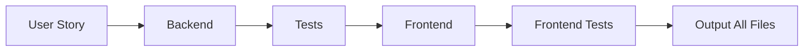
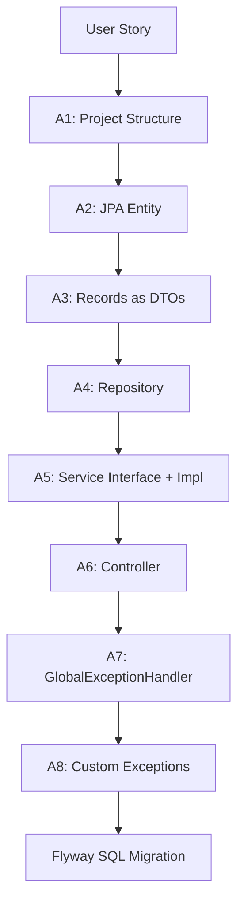
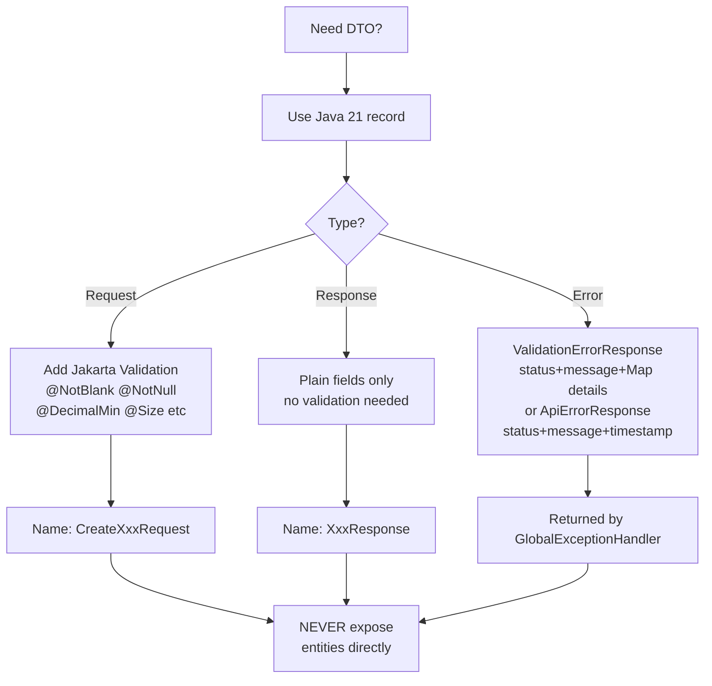
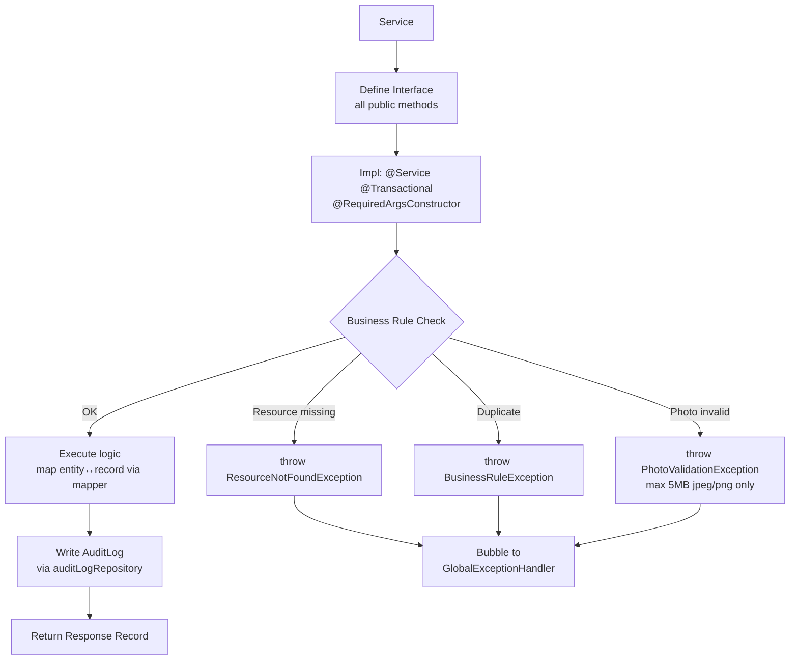
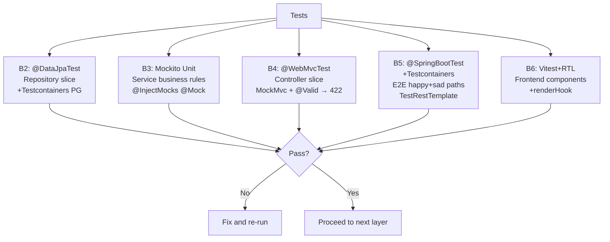
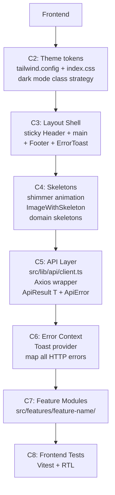
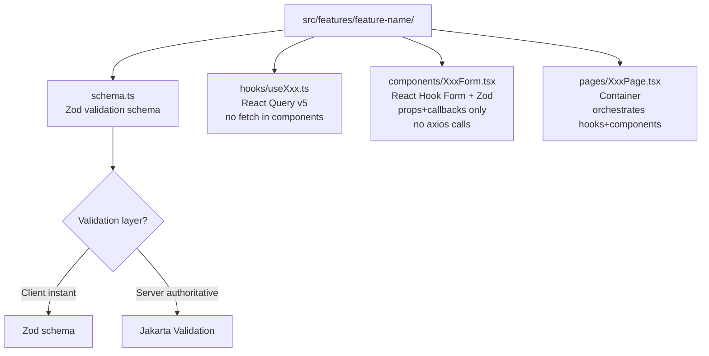
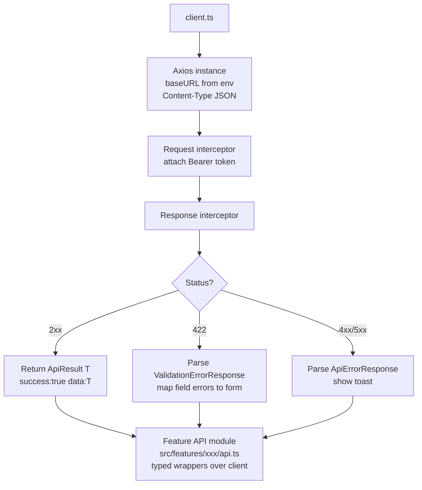
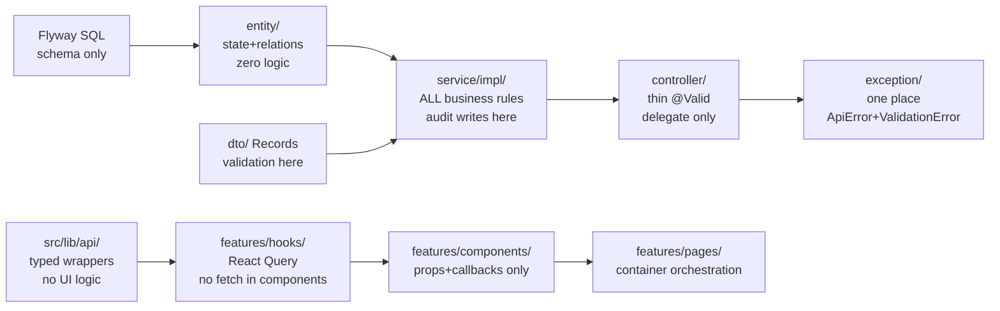

# Full-Stack UI + Backend Skill
Follow all diagrams exactly. Input: a user story. Output: complete implementation across all layers.

---

## PIPELINE OVERVIEW



---

## PART A — BACKEND PIPELINE



---

## A1 — PROJECT STRUCTURE

```mermaid
flowchart TD
    ROOT[src/main/java/mls/sho/dms/] --> ENT[entity/\nJPA @Entity classes]
    ROOT --> REPO[repository/\nSpring Data JPA]
    ROOT --> APP[application/]
    APP --> DTO[dto/ — Java 21 Records]
    APP --> SVC[service/ — interfaces + impls]
    APP --> MAP[mapper/ — Entity↔Record]
    APP --> EXC[exception/ — custom + GlobalHandler]
    ROOT --> INF[infrastructure/\nconfig/ persistence/]
    ROOT --> WEB[web/controller/\n@RestController]
    ROOT2[src/test/java/mls/sho/dms/] --> TR[repository/ @DataJpaTest]
    ROOT2 --> TS[application/service/ Mockito]
    ROOT2 --> TC[web/controller/ @WebMvcTest]
    ROOT2 --> TI[integration/ @SpringBootTest+TC]
```

---

## A2 — ENTITY RULES

```mermaid
flowchart TD
    A[Define Entity] --> B[@Entity @Table snake_case]
    B --> C[@Id @GeneratedValue UUID]
    C --> D[Audit: @CreationTimestamp\n@UpdateTimestamp]
    D --> E[Enums: @Enumerated STRING]
    E --> F[@Column nullable=false length=N]
    F --> G[equals/hashCode\non natural key NOT id]
    G --> H[@Version for optimistic lock\non hot entities]
    H --> I[Zero business logic\ndelegate to service]
```

---

## A3 — RECORDS AS DTOs



---

## A4 — REPOSITORY RULES

```mermaid
flowchart TD
    A[Repository] --> B[extends JpaRepository Entity UUID]
    B --> C{Query type?}
    C -->|Simple| D[Spring derived method\nexistsByNameIgnoreCaseAndCategory]
    C -->|Complex| E[@Query JPQL with\nJOIN FETCH to avoid N+1]
    C -->|Filter| F[findByXxxAndStatus\nfindByIdAndStatus]
    D & E & F --> G[Return Optional or List\nnever null]
```

---

## A5 — SERVICE RULES



---

## A6 — CONTROLLER RULES

```mermaid
flowchart TD
    A[Controller] --> B[@RestController\n@RequestMapping /api/v1/xxx\n@RequiredArgsConstructor]
    B --> C[Inject Service only\nnot repository]
    C --> D{Method type?}
    D -->|POST| E[@PostMapping\n@ResponseStatus CREATED 201\n@Valid @RequestBody]
    D -->|GET| F[@GetMapping\n@ResponseStatus OK 200]
    D -->|PUT/PATCH| G[@PutMapping\n@ResponseStatus OK 200\n@Valid @RequestBody]
    D -->|DELETE| H[@DeleteMapping\n@ResponseStatus NO_CONTENT 204]
    E & F & G & H --> I[Delegate to service\nReturn DTO only — thin controller]
    I --> J[@AuthenticationPrincipal String username\nfor audit trail]
```

---

## A7 — EXCEPTION HANDLER

```mermaid
flowchart TD
    A[@RestControllerAdvice] --> B{Exception type?}
    B -->|MethodArgumentNotValidException| C[422 Unprocessable\nValidationErrorResponse\nfield→messages map]
    B -->|ResourceNotFoundException| D[404 Not Found\nApiErrorResponse]
    B -->|BusinessRuleException| E[409 Conflict\nApiErrorResponse]
    B -->|PhotoValidationException| F[400 Bad Request\nApiErrorResponse]
    B -->|Exception generic| G[500 Internal\nApiErrorResponse\nhide stack trace]
    C & D & E & F & G --> H[Timestamp: ISO-8601 UTC]
```

---

## PART B — TESTING PYRAMID



---

## PART C — FRONTEND PIPELINE



---

## C7 — FEATURE MODULE STRUCTURE



---

## C5 — API LAYER RULES



---

## SEPARATION OF CONCERNS — HARD RULES



---

## OUTPUT CHECKLIST

```mermaid
flowchart TD
    OUT[Output per user story] --> E1[Entities — JPA annotated]
    OUT --> E2[Records — Request+Response DTOs]
    OUT --> E3[Repository — derived+@Query methods]
    OUT --> E4[Service — Interface + Impl + comments]
    OUT --> E5[Controller — verbs+status codes+@Valid]
    OUT --> E6[GlobalExceptionHandler]
    OUT --> E7[Flyway SQL migration]
    OUT --> E8[Tests — DataJpa+Mockito+WebMvc+SpringBoot]
    OUT --> E9[Frontend Theme — tokens+tailwind+css]
    OUT --> E10[Frontend Layout — Layout+Header+Footer]
    OUT --> E11[Skeletons — shimmer+ImageWithSkeleton]
    OUT --> E12[Frontend API — client.ts+feature module]
    OUT --> E13[Frontend Feature — schema+hook+form+page]
    OUT --> E14[Frontend Tests — RTL+renderHook]
    E1 & E2 & E3 & E4 & E5 & E6 & E7 & E8 & E9 & E10 & E11 & E12 & E13 & E14 --> DONE[✅ Complete]
```



---

## TECH STACK
`Java 21 · Spring Boot 3.3 · JPA/Hibernate 6 · PostgreSQL · Flyway · JUnit5 · Mockito 5 · Testcontainers · springdoc-openapi 2 · React 18 · TypeScript 5 · Vite · shadcn/ui · Tailwind v3 · TanStack Query v5 · Zustand · React Hook Form · Zod · Axios`