# UX Architecture & Information Design Skill
Follow all diagrams exactly. Input: user stories / epics. Output: complete UX blueprint before any code is written.

---

## PIPELINE OVERVIEW

```mermaid
flowchart LR
    A[Epics + User Stories] --> B[S1: Extract Actors & Roles]
    B --> C[S2: Domain Grouping]
    C --> D[S3: Navigation Architecture]
    D --> E[S4: Page Inventory]
    E --> F[S5: Layout Zone Maps]
    F --> G[S6: Component Dictionary]
    G --> H[S7: Interaction Flows]
    H --> I[S8: UX Rules Applied]
    I --> J[S9: Handoff Checklist]
    J --> K[Output to Frontend Skill]
```

---

## STEP 1 — ACTOR & ROLE EXTRACTION

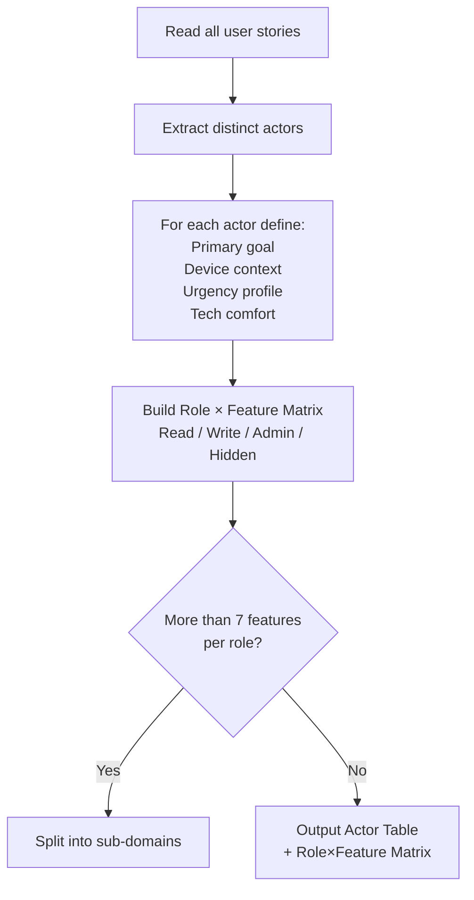

**Actor Table format:**
`Role | Primary Goal | Device | Urgency | Access Level`

**Role × Feature Matrix format:**
`Feature | RoleA | RoleB | RoleC → ✅Write / 👁Read / ❌Hidden`

---

## STEP 2 — DOMAIN GROUPING

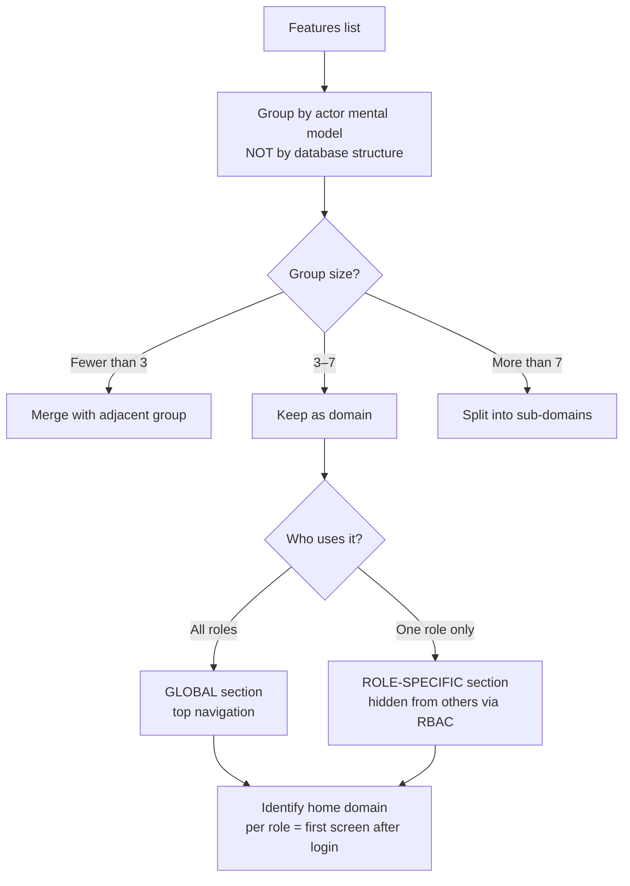

**Domain Map format:**
```
GLOBAL → Dashboard
ROLE_A DOMAINS → Domain1, Domain2
ROLE_B DOMAINS → Domain3
```

---

## STEP 3 — NAVIGATION ARCHITECTURE

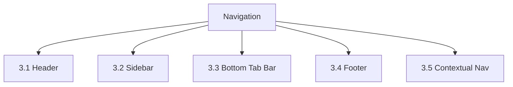

### 3.1 Header Rules

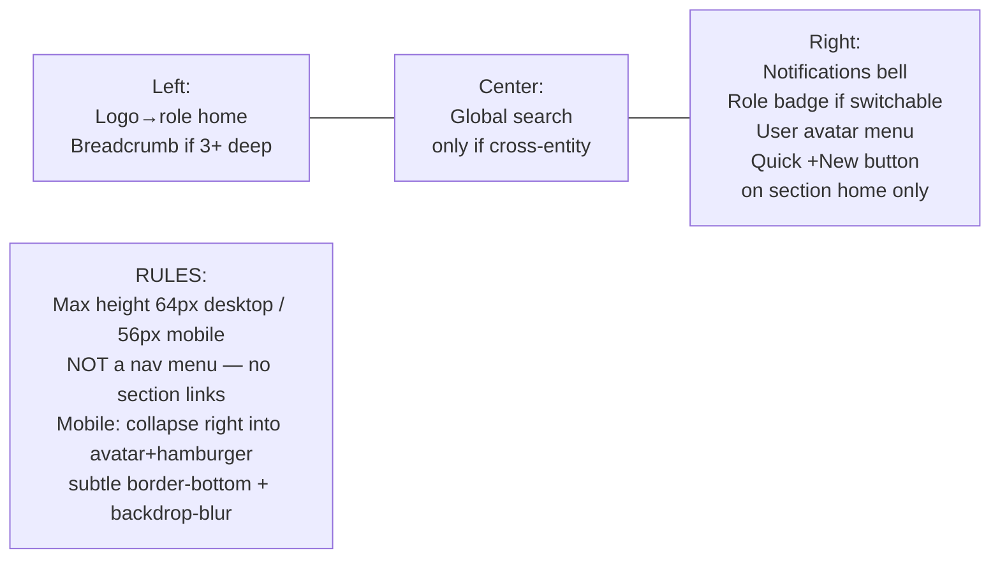

### 3.2 Sidebar Rules

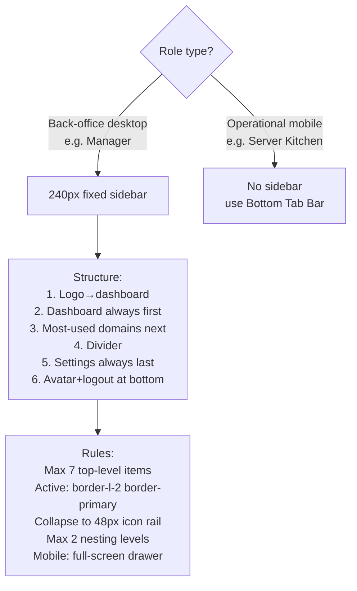

### 3.3 Bottom Tab Bar Rules

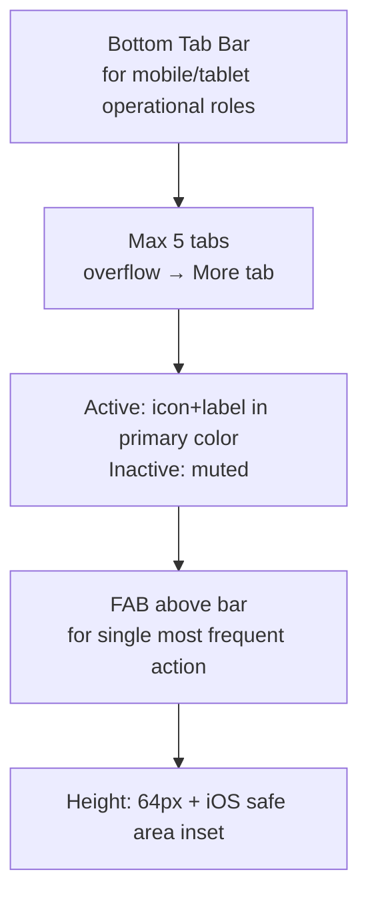

### 3.4 Footer Policy

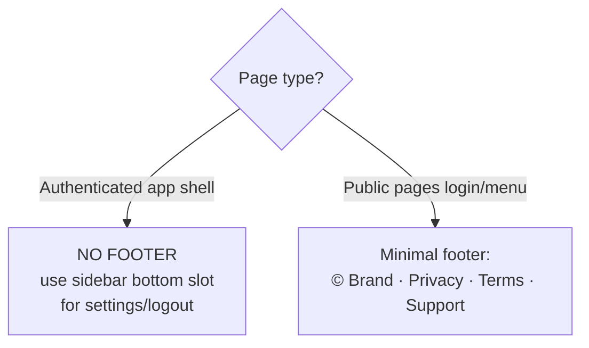

### 3.5 Contextual Navigation

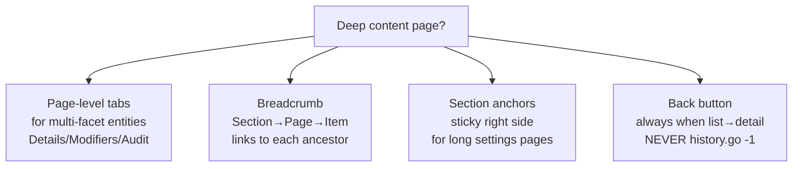

---

## STEP 4 — PAGE INVENTORY

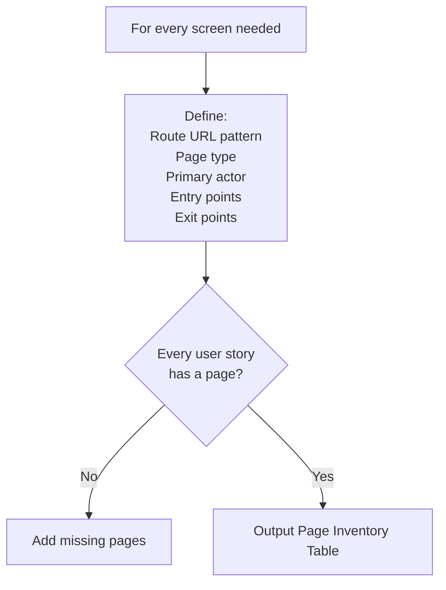

**Page types:** `Auth | Dashboard | List | Detail | CreateForm | EditForm | Wizard | FullScreenTool | Settings | Public`

**Table format:**
`Page | Route | Type | Primary Actor | Entry From | Exits To`

---

## STEP 5 — LAYOUT ZONE SPECIFICATION

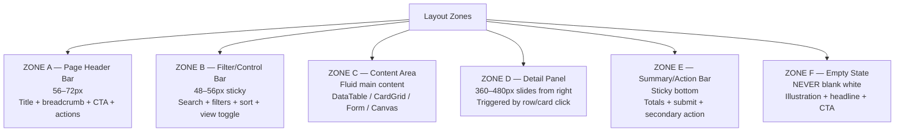

### Zone Maps per Page Type

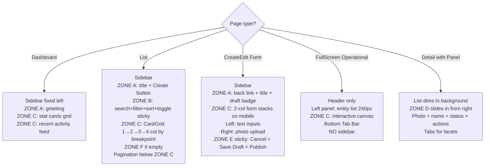

---

## STEP 6 — COMPONENT PLACEMENT DICTIONARY

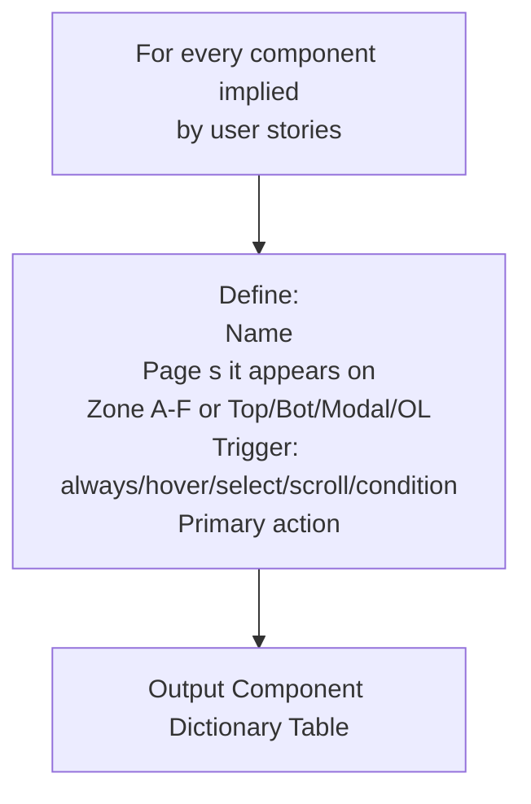

**Table format:**
`Component | Pages | Zone | Trigger | Primary Action`

**Always include these universal components:**
`GlobalHeader · SidebarNav · BottomTabBar · PageHeader · FilterBar · EmptyState · ErrorToast · ValidationInlineError · ConfirmDeleteDialog · FormActionBar · StatusBadge · ImageWithSkeleton · DetailSlidePanel · BreadcrumbNav · PageTabs`

---

## STEP 7 — INTERACTION FLOW SPECIFICATION

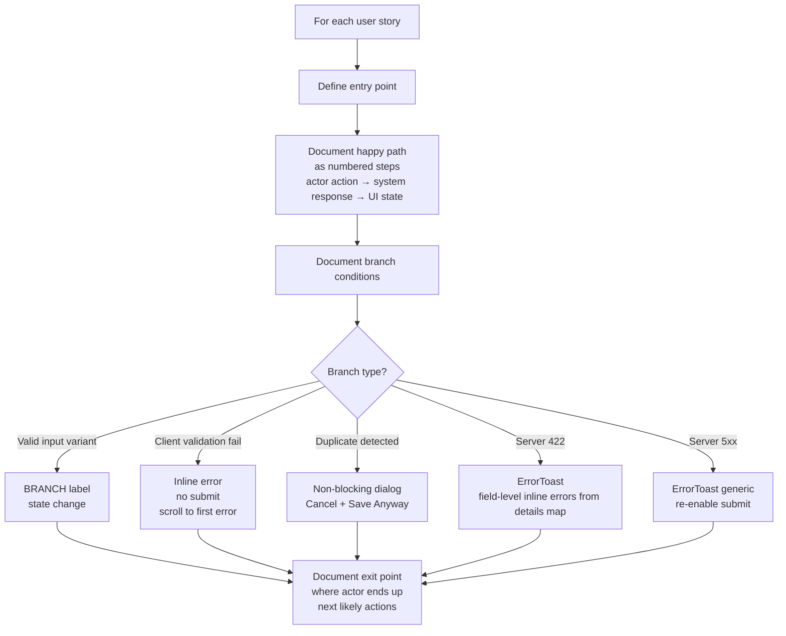

---

## STEP 8 — UX RULES (APPLY UNIVERSALLY)

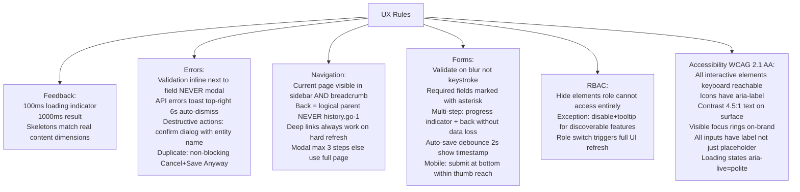

### Responsive Breakpoints

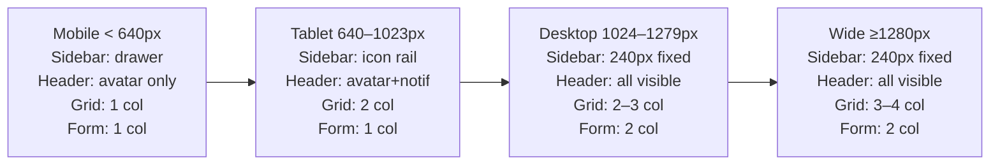

---

## STEP 9 — HANDOFF CHECKLIST

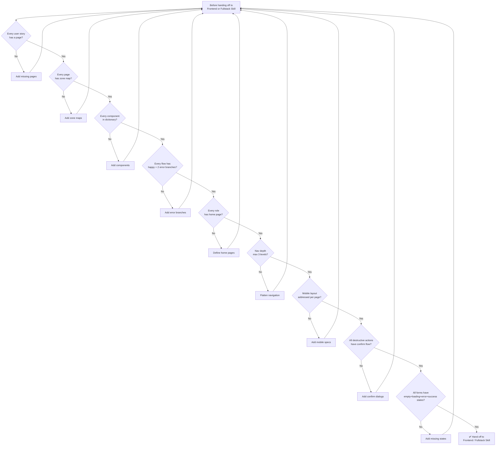

---

## OUTPUT FORMAT (in order)

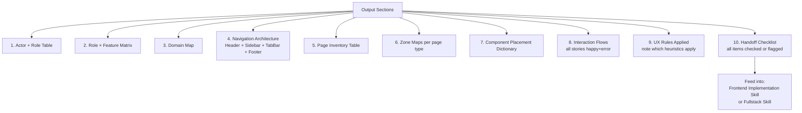