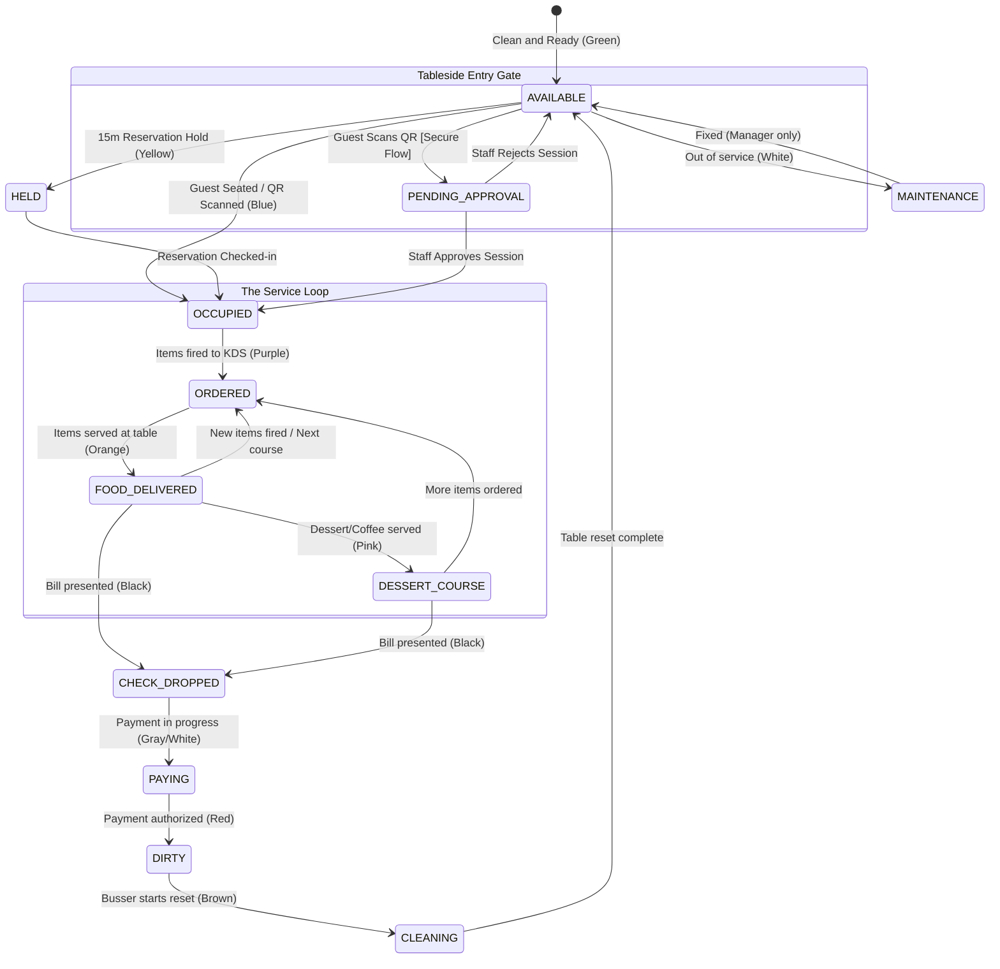

# Shopro POS: Integrated Table Lifecycle Workflow (11-State Machine)

This document defines the final table lifecycle for Shopro POS, strictly aligned with the **11-State Machine** in the requirements while supporting iterative, real-world multi-course service.

## 🔄 The Shopro Domain State Machine
The lifecycle follows an iterative flow within the core service states to accommodate multiple courses and re-orders.

---

## 1. Initial Access & Presence
- **State: AVAILABLE (Green)**
    - *Definition:* Sanity checked, cleaned, and ready for guests.
- **State: HELD (Yellow)**
    - *Definition:* Locked 15 minutes prior to a reservation. Prevents walk-in seating.
- **State: OCCUPIED (Blue)**
    - *Definition:* Guests are seated. A `DRAFT` order exists. No items have been sent to the kitchen yet.
    - *Tableside Trigger:* Scanning a Secure QR code immediately transitions the table to **OCCUPIED** (if available) and alerts staff via **TABLE_OCCUPIED** notification.

## 2. The Iterative Service Loop (Engagement)
- **State: ORDERED (Purple)**
    - *Trigger:* Server taps **"Send to Kitchen"** for any `DRAFT` items.
    - *Action:* Kitchen prep begins. KDS shows active tickets.
- **State: FOOD_DELIVERED (Orange)**
    - *Trigger:* Runner confirms delivery of items or expo "bimps" the ticket.
    - *Activity:* Guests are eating. Server performs the "2-Minute Check-Back".
- **🔁 The Loop:** If guests want more (drinks, sides, or the next course), addition of `DRAFT` items brings them to the sidebar, and firing them transitions the table back to **ORDERED** logic.
- **State: DESSERT_COURSE (Pink)**
    - *Trigger:* Items from the "Dessert" or "After-Dinner" categories are served.
    - *Context:* Main plates are cleared (Pre-bussing complete).

## 3. Settlement & Exit
- **State: CHECK_DROPPED (Black)**
    - *Trigger:* Server produces the final bill.
    - *Action:* Order is locked to prevent modifications (unless manager overrides).
- **State: PAYING (Gray/White)**
    - *Trigger:* Payment processing initiated (Guest enters PIN or scans QR).
    - *Constraint:* Table remains restricted until authorization is received.

## 4. Reset & Turnover
- **State: DIRTY (Red)**
    - *Trigger:* Final authorization received (PAID).
    - *Action:* Visual alert triggered for Bussing staff.
- **State: CLEANING (Brown)**
    - *Trigger:* Busser initiates the "Clear and Wipe" task.
- **Back to AVAILABLE:** Busser marks "Ready". The cycle starts anew.

---

## 7. Responsibility Matrix: Actors & Transitions

| Formal State | Color | Primary Actor | Trigger Activity |
| :--- | :--- | :--- | :--- |
| **AVAILABLE** | 🟢 | **Busser** | Manual reset after cleaning. |
| **HELD** | 🟡 | **System** | Automatic 15m pre-reservation buffer. |
| **OCCUPIED** | 🔵 | **Host / Server / Guest** | Seating guest or **Guest QR Scan** (triggers instant occupancy). |
| **ORDERED** | 🟣 | **Server** | Firing a new or subsequent course to the KDS. |
| **FOOD_DELIVERED**| 🟠 | **Runner / Expo** | Bumping items from KDS or delivery confirmation. |
| **DESSERT_COURSE**| 🩷 | **Server** | Serving dessert/coffee items. |
| **CHECK_DROPPED** | ⚫ | **Server** | Tapping "Print/Drop Check" on the POS. |
| **PAYING** | ⚪ | **Guest / System** | Initiating transaction via terminal or QR. |
| **DIRTY** | 🔴 | **System** | Automatic transition upon Payment Authorization. |
| **CLEANING** | 🟤 | **Busser** | Tapping "Start Cleaning" on the mobile/POS. |
| **MAINTENANCE** | ⬜ | **Manager** | Manual override for service/repair (PIN required). |

---

## 8. Transition Control Logic: Manual vs. Automated

The Shopro POS balances staff efficiency with business logic guards through a mix of manual and automated transitions.

### 🤖 System-Driven (Automated)
- **HELD (Yellow):** Triggered automatically 15 minutes before a scheduled reservation to ensure the table is clear.
- **PAYING (Gray):** Triggered when a guest initiates payment via the terminal or QR code.
- **OCCUPIED (Blue):** Automatically triggered on **Valid QR Scan** (for secure tableside sessions).
- **DIRTY (Red):** Triggered the instant the final transaction for the session is authorized (`PAID`).
- **SESSION_EXPIRED:** Automatically triggered when table status moves to **CLEANING** or **AVAILABLE**.

### 👤 Staff-Driven (Manual)
- **AVAILABLE (Green):** Marked by the **Busser** after confirming the table is physically reset and sanitized.
- **OCCUPIED (Blue):** Marked by the **Host** or **Server** when seating guests or checking in a reservation.
- **ORDERED (Purple):** Marked by the **Server** every time a new course or item is "Fired" to the kitchen.
- **FOOD_DELIVERED (Orange):** Marked by the **Runner** or **Expo** staff upon physical delivery to the table.
- **DESSERT_COURSE (Pink):** Marked by the **Server** when dessert or coffee rounds are served.
- **CHECK_DROPPED (Black):** Marked by the **Server** when the bill is presented.
- **CLEANING (Brown):** Marked by the **Busser** to signal they have started the turnover process.
- **MAINTENANCE (White):** Marked by a **Manager** (PIN required) to pull a table out of active service.

---

## 🚀 Technical Constraints & Gates
- **Gate 1:** Table cannot move from **DIRTY** to **AVAILABLE** if any open or unpaid `DRAFT` transactions exist in the session.
- **Gate 2:** `RE-ORDER` from **FOOD_DELIVERED** back to **ORDERED** maintains the **Original Seat Assignments** and **Sub-tickets** to ensure billing integrity.
- **Gate 3:** Transitions to **AVAILABLE** from **MAINTENANCE** or **CLEANING** require specific staff role permissions (`BUSSER:RESET` or `MANAGER:MAINTENANCE`).
