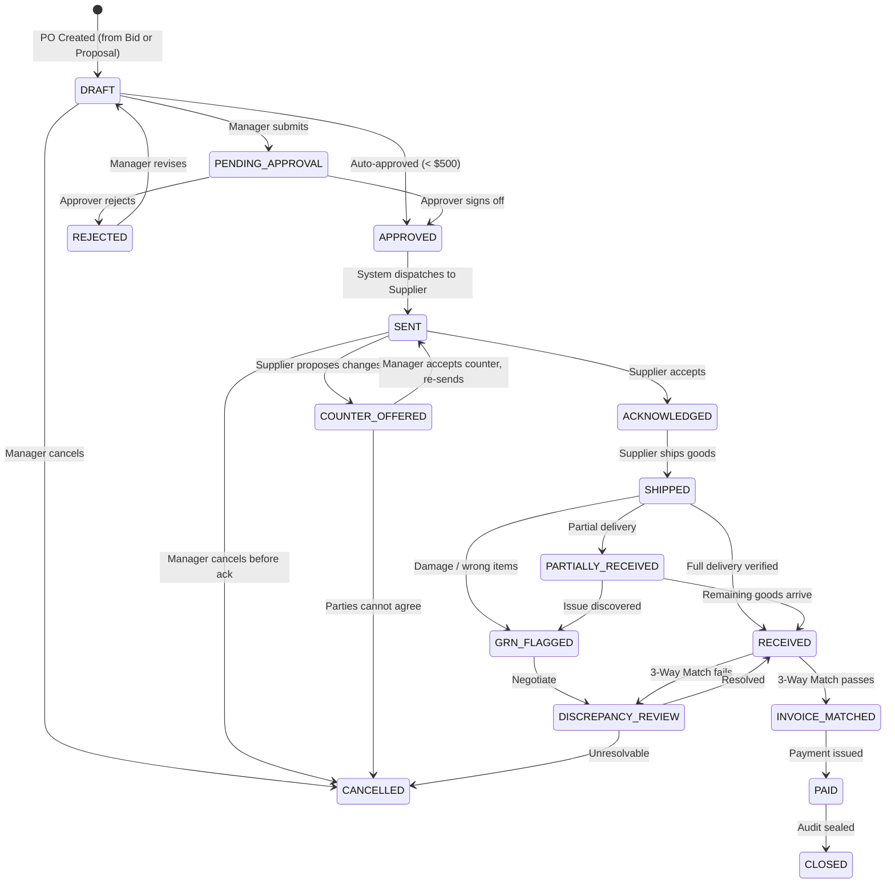
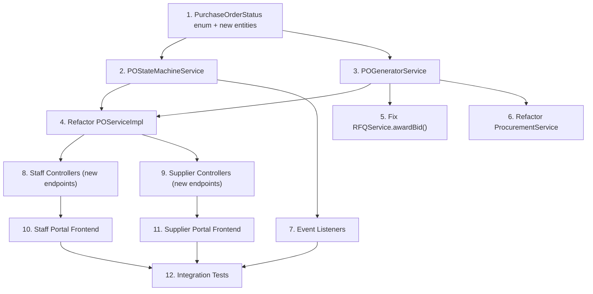

# Design: Supplier PO Generation & Communication State Machine

## Background & Two Entry Points

There are **two entry points** for PO generation in Shopro:

| # | Trigger | Source Entity | Scenario |
|---|---|---|---|
| **A** | **Bid Awarded** | `VendorBid` via `RFQ` | Competitive bidding — manager picks the best bid. |
| **B** | **Proposal Accepted** | `VendorPriceProposal` | Proactive pricing — supplier offers a deal outside of an RFQ. |

Both paths converge into the **same PO lifecycle state machine** after the PO is created.

---

## Full State Machine (Reference)



---

# Implementation Split

## Layer 1: Shared Backend Services

> These are the **core domain services** used by **both** the Supplier Portal API and the Staff Portal API. They live in `shopro-pos-server` and contain all business logic, state transitions, and side-effects.

---

### 1.1 `POStateMachineService` — [NEW]

The **heart of the system**. Encapsulates all legal transitions and fires domain events.

| Method | Description | Consumed By |
|:---|:---|:---|
| `transition(poId, targetState, actorId, metadata)` | Validates the transition is legal, updates status, fires `POStateChangedEvent` | All services below |
| `getAllowedTransitions(poId)` | Returns the set of next-possible states for a given PO | Both portals (for button visibility) |

**What it replaces**: The raw `po.setStatus(...)` calls scattered across `POServiceImpl`.

```
Allowed transitions map (enforced):

DRAFT               → [PENDING_APPROVAL, APPROVED, CANCELLED]
PENDING_APPROVAL     → [APPROVED, REJECTED]
REJECTED             → [DRAFT]
APPROVED             → [SENT]
SENT                 → [ACKNOWLEDGED, COUNTER_OFFERED, CANCELLED]
COUNTER_OFFERED      → [SENT, CANCELLED]
ACKNOWLEDGED         → [SHIPPED]
SHIPPED              → [RECEIVED, PARTIALLY_RECEIVED, GRN_FLAGGED]
PARTIALLY_RECEIVED   → [RECEIVED, GRN_FLAGGED]
GRN_FLAGGED          → [DISCREPANCY_REVIEW]
RECEIVED             → [INVOICE_MATCHED, DISCREPANCY_REVIEW]
DISCREPANCY_REVIEW   → [RECEIVED, CANCELLED]
INVOICE_MATCHED      → [PAID]
PAID                 → [CLOSED]
```

---

### 1.2 `POGeneratorService` — [NEW]

Unified PO creation regardless of source.

| Method | Description | Consumed By |
|:---|:---|:---|
| `createFromBid(bidId, staffId)` | Creates a DRAFT PO from an awarded bid. Links `sourceBidId`. | `RFQService.awardBid()` |
| `createFromProposal(proposalId, staffId)` | Creates a DRAFT PO from an accepted proposal. Links `sourceProposalId`. | `ProcurementService.createDraftPoFromProposal()` |
| `createManual(request, staffId)` | Existing manual PO creation. | `POService.createOrder()` |

**What it replaces**: The PO creation logic currently duplicated across `POServiceImpl.createOrder()` and `ProcurementServiceImpl.createDraftPoFromProposal()`.

---

### 1.3 `POService` — [MODIFY] [POService.java](file:///home/arun/IdeaProjects/shopro-pos/shopro-pos-server/src/main/java/mls/sho/dms/application/service/inventory/POService.java)

| Method | Status | Description |
|:---|:---:|:---|
| `findAll()` | ✅ Exists | List all POs |
| `findById(poId)` | 🆕 Add | Get single PO with lines + status history |
| `submitForApproval(poId)` | ✅ Exists → refactor | Delegate to `POStateMachineService` |
| `approveOrder(poId, approverId)` | ✅ Exists → refactor | Delegate to `POStateMachineService` |
| `rejectOrder(poId, approverId, reason)` | ✅ Exists → refactor | Delegate to `POStateMachineService` |
| `cancelOrder(poId)` | ✅ Exists → refactor | Delegate to `POStateMachineService` |
| `acknowledgeOrder(poId)` | ✅ Exists → refactor | Delegate to `POStateMachineService` |
| `shipOrder(poId, trackingNumber, ...)` | ✅ Exists → refactor | Delegate to `POStateMachineService` |
| `counterOffer(poId, counterOfferRequest)` | 🆕 Add | Supplier counter-offers on a SENT PO |
| `acceptCounterOffer(poId, staffId)` | 🆕 Add | Manager accepts counter, amend & re-send |
| `rejectCounterOffer(poId, staffId)` | 🆕 Add | Manager rejects counter → cancel |

---

### 1.4 `RFQService` — [MODIFY] [RFQService.java](file:///home/arun/IdeaProjects/shopro-pos/shopro-pos-server/src/main/java/mls/sho/dms/application/service/inventory/RFQService.java)

| Method | Status | Description |
|:---|:---:|:---|
| `awardBid(bidId)` | ✅ Exists → **fix** | Currently only logs PO generation but **doesn't actually create** the PO. Must call `POGeneratorService.createFromBid()`. |

---

### 1.5 `ProcurementService` — [MODIFY] [ProcurementService.java](file:///home/arun/IdeaProjects/shopro-pos/shopro-pos-server/src/main/java/mls/sho/dms/application/service/inventory/ProcurementService.java)

| Method | Status | Description |
|:---|:---:|:---|
| `createDraftPoFromProposal(proposalId, staffId)` | ✅ Exists → refactor | Delegate PO creation to `POGeneratorService.createFromProposal()` |

---

### 1.6 `ReceivingService` — [MODIFY] [ReceivingService.java](file:///home/arun/IdeaProjects/shopro-pos/shopro-pos-server/src/main/java/mls/sho/dms/application/service/inventory/ReceivingService.java)

| Method | Status | Description |
|:---|:---:|:---|
| `receiveGoods(...)` | ✅ Exists → refactor | Delegate status change to `POStateMachineService` |
| `processInvoiceAndMatch(...)` | ✅ Exists → refactor | Delegate status change to `POStateMachineService` |

---

### 1.7 `SupplierPolicyService` — [NEW]

Per-supplier configuration.

| Method | Description |
|:---|:---|
| `getPolicy(supplierId)` | Returns policy: auto-ack, payment terms, counter-offer allowed, tolerances |
| `shouldAutoAcknowledge(supplierId)` | Whether this supplier skips the ACK step |
| `getMatchTolerances(supplierId)` | Qty and price tolerance percentages for 3-way match |

---

### 1.8 Event Listeners — [NEW]

| Listener | Triggers On | Action |
|:---|:---|:---|
| `PONotificationListener` | All `POStateChangedEvent` | Sends in-app + email notifications per the Events table |
| `POInventoryListener` | `RECEIVED` | Updates `RawIngredient.currentStock` |
| `POAccountingListener` | `INVOICE_MATCHED` | Creates payment requisition |
| `POAuditListener` | All transitions | Logs to `POStatusHistory` audit table |

---

### 1.9 New Entities & Enums

| Entity / Enum | Status | Changes |
|:---|:---:|:---|
| `PurchaseOrderStatus` | 🔧 Modify | Add `COUNTER_OFFERED`, `SHIPPED` (rename current `SENT` usage in `shipOrder`) |
| `PurchaseOrder` | 🔧 Modify | Add `sourceBidId`, `sourceProposalId`, `acknowledgedAt`, `counterOfferNotes`, `counterOfferDate`, `counterOfferQty`, `counterOfferPrice` |
| `POStatusHistory` | 🆕 New | Audit trail: `poId`, `fromStatus`, `toStatus`, `changedBy`, `changedAt`, `reason` |
| `SupplierPolicy` | 🆕 New | `supplierId`, `autoAcknowledge`, `counterOfferAllowed`, `paymentTerms`, `qtyTolerance`, `priceTolerance` |

---

## Layer 2: Supplier Portal (What the Supplier sees and does)

> The Supplier Portal is a **separate authenticated area** where suppliers manage their side of the PO lifecycle. Frontend lives in `shopro-pos-web` under `features/inventory/` with supplier-specific pages.

---

### 2.1 Backend: `SupplierPortalController` — [MODIFY] [SupplierPortalController.java](file:///home/arun/IdeaProjects/shopro-pos/shopro-pos-server/src/main/java/mls/sho/dms/application/controller/inventory/SupplierPortalController.java)

**Existing endpoints** (consume `SupplierPortalService`):

| Endpoint | Method | Status | What it does |
|:---|:---:|:---:|:---|
| `/api/supplier/dashboard` | GET | ✅ | Dashboard stats (active RFQs, pending bids, win rate) |
| `/api/supplier/rfqs` | GET | ✅ | Active RFQs the supplier can bid on |
| `/api/supplier/rfq/{id}/bid` | POST | ✅ | Submit a bid on an RFQ |
| `/api/supplier/inventory` | GET | ✅ | View ingredient stock levels they supply |
| `/api/supplier/proposals` | POST | ✅ | Submit a proactive price proposal |
| `/api/supplier/proposals/mine` | GET | ✅ | View own submitted proposals with status |
| `/api/supplier/purchase-orders` | GET | ✅ | List POs assigned to this supplier |

**New endpoints needed:**

| Endpoint | Method | Status | What it does |
|:---|:---:|:---:|:---|
| `/api/supplier/po/{id}` | GET | 🆕 | View single PO detail (lines, terms, status history) |
| `/api/supplier/po/{id}/acknowledge` | POST | 🆕 | Acknowledge a SENT PO |
| `/api/supplier/po/{id}/counter-offer` | POST | 🆕 | Submit a counter-offer on a SENT PO |
| `/api/supplier/po/{id}/ship` | POST | 🆕 | Mark PO as shipped (tracking number, invoice upload) |
| `/api/supplier/po/{id}/status-history` | GET | 🆕 | View the PO's full status change log |
| `/api/supplier/po/{id}/allowed-actions` | GET | 🆕 | Get what actions are available (Ack, Counter, Ship) |

---

### 2.2 Frontend: Supplier Portal Pages

| Page / Component | File | Status | What the Supplier does here |
|:---|:---|:---:|:---|
| **Supplier Dashboard** | [SupplierDashboard.tsx](file:///home/arun/IdeaProjects/shopro-pos/shopro-pos-web/src/features/inventory/pages/SupplierDashboard.tsx) | ✅ → enhance | Add "POs Awaiting Action" card (SENT POs needing ack/counter) |
| **Supplier RFQ List** | [SupplierRfqList.tsx](file:///home/arun/IdeaProjects/shopro-pos/shopro-pos-web/src/features/inventory/pages/SupplierRfqList.tsx) | ✅ | View and bid on open RFQs |
| **Supplier PO Fulfillment** | [SupplierPOFulfillmentPage.tsx](file:///home/arun/IdeaProjects/shopro-pos/shopro-pos-web/src/features/inventory/pages/SupplierPOFulfillmentPage.tsx) | ✅ → **major rework** | This is where the supplier acknowledges, counter-offers, or ships. Needs new sections/tabs. |
| **Supplier Proposals** | [SupplierProposalsList.tsx](file:///home/arun/IdeaProjects/shopro-pos/shopro-pos-web/src/features/inventory/components/SupplierProposalsList.tsx) | ✅ | View submitted proposals |
| **PO Detail View** | 🆕 `SupplierPODetailPage.tsx` | 🆕 | Full PO view: lines, status timeline, action buttons |
| **Counter-Offer Dialog** | 🆕 `CounterOfferDialog.tsx` | 🆕 | Form: changed date / qty / price + reason |

**Hooks needed:**

| Hook | File | Status | Purpose |
|:---|:---|:---:|:---|
| `useSupplierPO` | [useSupplierPO.ts](file:///home/arun/IdeaProjects/shopro-pos/shopro-pos-web/src/features/inventory/hooks/useSupplierPO.ts) | ✅ → enhance | Add `acknowledge`, `counterOffer`, `ship` mutations |
| `useSupplierPODetail` | 🆕 `useSupplierPODetail.ts` | 🆕 | Fetch single PO detail + allowed actions |

**Supplier Portal Action Matrix** — what actions the supplier sees at each PO state:

| PO State | Visible Actions | Button |
|:---|:---|:---|
| `SENT` | Acknowledge, Counter-Offer | Primary: "Acknowledge", Outline: "Counter-Offer" |
| `COUNTER_OFFERED` | *(waiting for Shopro)* | Disabled: "Awaiting Response" |
| `ACKNOWLEDGED` | Ship | Primary: "Mark as Shipped" |
| `SHIPPED` | *(waiting for Shopro to receive)* | Badge: "In Transit" |
| All others | Read-only view | — |

---

## Layer 3: Shopro Staff Portal (What the Restaurant Staff sees and does)

> The Staff Portal is the **admin/management area** for restaurant team members. They create RFQs, review bids, create POs, approve orders, receive deliveries, and perform invoice matching.

---

### 3.1 Backend: Staff-Facing Controllers — [MODIFY]

**`PurchaseOrderController`** — [PurchaseOrderController.java](file:///home/arun/IdeaProjects/shopro-pos/shopro-pos-server/src/main/java/mls/sho/dms/web/controller/inventory/PurchaseOrderController.java)

| Endpoint | Method | Status | What it does |
|:---|:---:|:---:|:---|
| `/api/v1/inventory/po` | GET | ✅ | List all POs |
| `/api/v1/inventory/po` | POST | ✅ | Create manual PO |
| `/api/v1/inventory/po/{id}` | GET | 🆕 | View single PO detail with full history |
| `/api/v1/inventory/po/{id}/submit` | POST | ✅ | Submit for approval |
| `/api/v1/inventory/po/{id}/approve` | POST | ✅ | Approve |
| `/api/v1/inventory/po/{id}/reject` | POST | ✅ | Reject with reason |
| `/api/v1/inventory/po/{id}/cancel` | POST | ✅ | Cancel |
| `/api/v1/inventory/po/{id}/accept-counter` | POST | 🆕 | Accept counter-offer, amend & re-send |
| `/api/v1/inventory/po/{id}/reject-counter` | POST | 🆕 | Reject counter-offer → cancel |
| `/api/v1/inventory/po/{id}/status-history` | GET | 🆕 | View the PO audit trail |
| `/api/v1/inventory/po/{id}/allowed-actions` | GET | 🆕 | What the manager can do next |

**`RFQController`** — [RFQController.java](file:///home/arun/IdeaProjects/shopro-pos/shopro-pos-server/src/main/java/mls/sho/dms/application/controller/inventory/RFQController.java) — ✅ No changes needed

**`ProcurementController`** — [ProcurementController.java](file:///home/arun/IdeaProjects/shopro-pos/shopro-pos-server/src/main/java/mls/sho/dms/application/controller/inventory/ProcurementController.java) — ✅ No changes needed

**`ReceivingController`** — [ReceivingController.java](file:///home/arun/IdeaProjects/shopro-pos/shopro-pos-server/src/main/java/mls/sho/dms/application/controller/inventory/ReceivingController.java) — ✅ No changes needed (already has `receiveGoods` and `processInvoiceAndMatch`)

---

### 3.2 Frontend: Staff Portal Pages

| Page / Component | File | Status | What the Staff does here |
|:---|:---|:---:|:---|
| **Inventory Dashboard** | [InventoryDashboard.tsx](file:///home/arun/IdeaProjects/shopro-pos/shopro-pos-web/src/features/inventory/pages/InventoryDashboard.tsx) | ✅ → enhance | Add "POs Needing Attention" widget (pending approvals, counter-offers, GRN flags) |
| **RFQ Management** | [RFQManagementPage.tsx](file:///home/arun/IdeaProjects/shopro-pos/shopro-pos-web/src/features/inventory/pages/RFQManagementPage.tsx) | ✅ | Create RFQs, view bids, award bids |
| **VendorRFQ (bids view)** | [VendorRFQPage.tsx](file:///home/arun/IdeaProjects/shopro-pos/shopro-pos-web/src/features/inventory/pages/VendorRFQPage.tsx) | ✅ | Compare bids side-by-side and award |
| **Manual Procurement** | [ManualProcurementPanel.tsx](file:///home/arun/IdeaProjects/shopro-pos/shopro-pos-web/src/features/inventory/components/ManualProcurementPanel.tsx) | ✅ | Create manual POs, review proposals |
| **Supplier Management** | [SupplierManagementPage.tsx](file:///home/arun/IdeaProjects/shopro-pos/shopro-pos-web/src/features/inventory/pages/SupplierManagementPage.tsx) | ✅ → enhance | Add Supplier Policy config (auto-ack, tolerances, payment terms) |
| **PO List & Detail** | 🆕 `POManagementPage.tsx` | 🆕 | Full PO list with status filters + detail view with status timeline |
| **Counter-Offer Review** | 🆕 `CounterOfferReviewPanel.tsx` | 🆕 | Side panel showing counter-offer details with Accept/Reject/Negotiate |
| **GRN / Receiving Page** | 🆕 `GoodsReceivingPage.tsx` | 🆕 | Dock receiving: scan/enter qty, compare against PO, create GRN |
| **3-Way Match Panel** | 🆕 `ThreeWayMatchPanel.tsx` | 🆕 | Visual side-by-side: PO vs GRN vs Invoice, highlight mismatches |
| **PO Status Timeline** | 🆕 `POStatusTimeline.tsx` (component) | 🆕 | Vertical timeline showing all status changes with actor + timestamp |

**Hooks needed:**

| Hook | File | Status | Purpose |
|:---|:---|:---:|:---|
| `useRFQ` | [useRFQ.ts](file:///home/arun/IdeaProjects/shopro-pos/shopro-pos-web/src/features/inventory/hooks/useRFQ.ts) | ✅ | RFQ CRUD + award bid |
| `usePriceProposals` | [usePriceProposals.ts](file:///home/arun/IdeaProjects/shopro-pos/shopro-pos-web/src/features/inventory/hooks/usePriceProposals.ts) | ✅ | Review proposals + generate PO |
| `usePurchaseOrders` | 🆕 `usePurchaseOrders.ts` | 🆕 | List POs, approve, reject, cancel, handle counter-offers |
| `useReceiving` | 🆕 `useReceiving.ts` | 🆕 | Receive goods, process invoice, 3-way match |
| `usePOStatusHistory` | 🆕 `usePOStatusHistory.ts` | 🆕 | Fetch status timeline for a PO |

**Staff Portal Action Matrix** — what actions managers see at each PO state:

| PO State | Visible Actions | Button(s) |
|:---|:---|:---|
| `DRAFT` | Edit, Submit for Approval, Cancel | Primary: "Submit", Destructive: "Cancel" |
| `PENDING_APPROVAL` | Approve, Reject | Primary: "Approve", Destructive: "Reject" |
| `REJECTED` | Revise (reopen as DRAFT) | Outline: "Revise & Resubmit" |
| `APPROVED` | *(auto-dispatched)* | Badge: "Dispatching..." |
| `SENT` | Cancel (before ack) | Destructive: "Cancel PO" |
| `COUNTER_OFFERED` | Accept Counter, Reject Counter | Primary: "Accept", Destructive: "Reject" |
| `ACKNOWLEDGED` | *(waiting for supplier to ship)* | Badge: "Awaiting Shipment" |
| `SHIPPED` | Receive Goods (open GRN form) | Primary: "Receive Goods" |
| `RECEIVED` | Run 3-Way Match | Primary: "Match Invoice" |
| `DISCREPANCY_REVIEW` | Resolve, Cancel | Primary: "Resolve", Destructive: "Cancel" |
| `INVOICE_MATCHED` | *(finance processes payment)* | Badge: "Payment Pending" |

---

## Dependency Map & Implementation Order



**Recommended build order:**

| Phase | What | Estimated Effort |
|:---:|:---|:---|
| **1** | Entities, enums, `POStatusHistory` migration | Small |
| **2** | `POStateMachineService` + `POGeneratorService` | Medium |
| **3** | Refactor `POServiceImpl`, fix `awardBid()`, refactor `ProcurementServiceImpl` | Medium |
| **4** | Event listeners (notifications, inventory, audit) | Medium |
| **5** | Staff controller new endpoints + frontend pages | Large |
| **6** | Supplier controller new endpoints + frontend pages | Large |
| **7** | Integration + E2E tests | Medium |

---

## Verification Plan

### Automated Tests
1. `POStateMachineService`: every legal transition passes, every illegal transition throws
2. `POGeneratorService.createFromBid`: correct line mapping, `sourceBidId` linked
3. `POGeneratorService.createFromProposal`: correct pricing, `sourceProposalId` linked
4. `RFQService.awardBid()`: creates PO, sets bid to WON, closes RFQ
5. Counter-offer loop: `SENT` → `COUNTER_OFFERED` → `SENT` → `ACKNOWLEDGED`
6. Three-way match: auto-match within tolerance, flag outside tolerance

### Manual Verification
1. Staff: Award bid → verify PO auto-created in Drafts → approve → dispatch
2. Supplier: See SENT PO → acknowledge → ship with tracking → verify status timeline
3. Staff: Receive goods against PO → run 3-way match → verify payment flow
4. Supplier: Counter-offer → Staff reviews → accepts → verify amended PO re-sent
