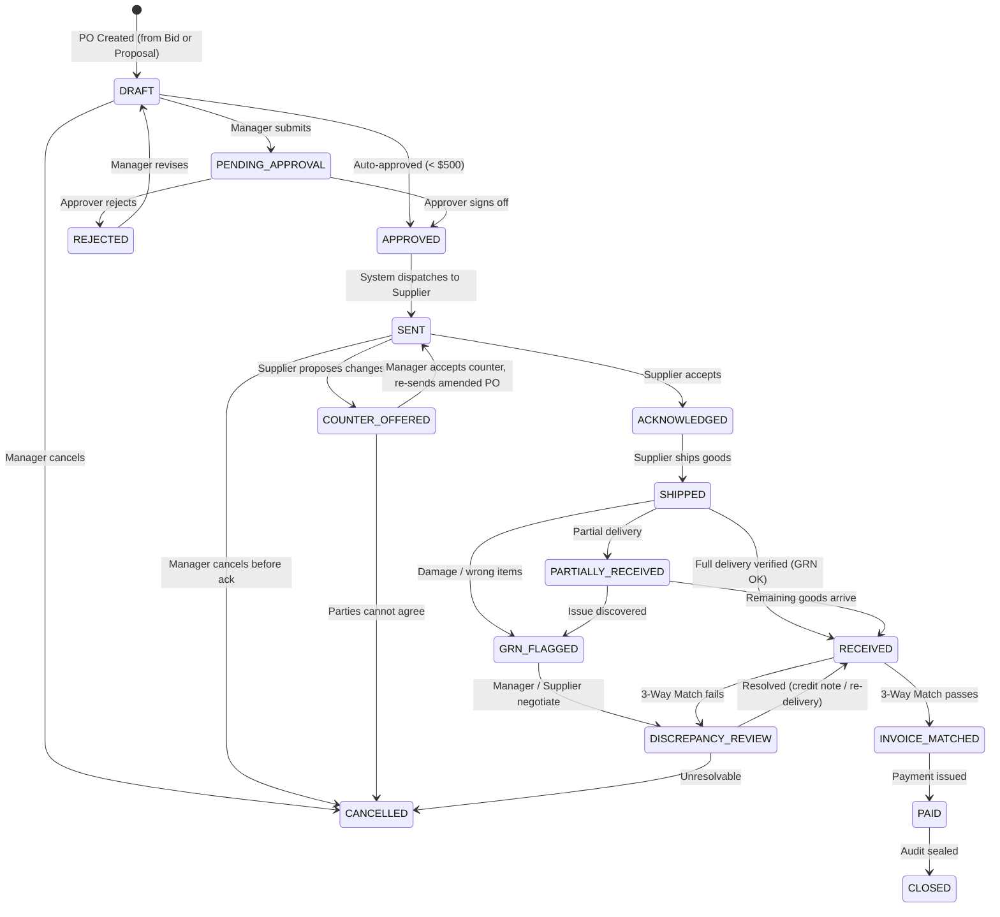
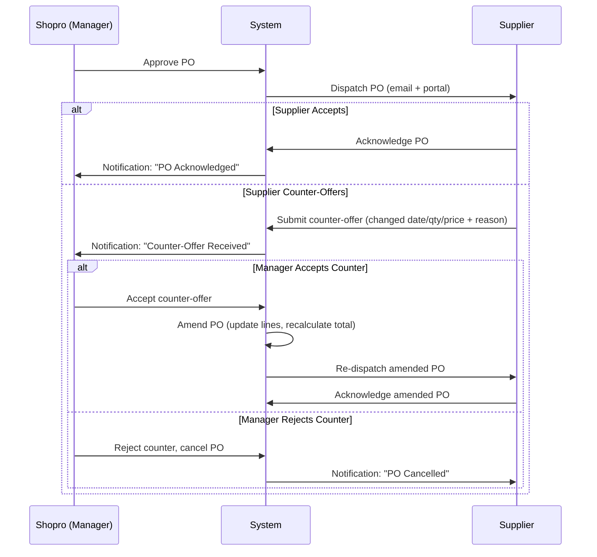

# Design: Real-World Supplier PO Generation & Communication State Machine

## Background

In real-world restaurant procurement, generating a Purchase Order (PO) and managing the supplier handshake is a standardized **Procure-to-Pay (P2P)** process. This design models Shopro's PO lifecycle to mirror how real businesses operate — including internal approvals, supplier counter-offers, goods receiving, three-way invoice matching, and dispute resolution.

There are **two entry points** for PO generation in Shopro:

| # | Trigger | Source Entity | Scenario |
|---|---|---|---|
| **A** | **Bid Awarded** | `VendorBid` via `RFQ` | Competitive bidding — manager picks the best bid from multiple suppliers. |
| **B** | **Proposal Accepted** | `VendorPriceProposal` | Proactive pricing — a supplier offers a price update or deal outside an RFQ. |

Both paths converge into the **same PO lifecycle state machine** after the PO is created.

---

## 1. Detailed Real-World Flows

### Path A: Bid Award → PO (Competitive Bidding)

This is the formal procurement route, used when the restaurant needs to compare offers.

| Step | Who | What Happens | System Side-Effect |
|:---:|:---:|---|---|
| 1 | **SYSTEM** | Stock drops below reorder point, or Manager manually creates an RFQ. | `RFQ` created with status `OPEN`. Eligible suppliers notified via email + portal. |
| 2 | **Supplier(s)** | Each supplier logs into the portal, reviews the RFQ, and submits a bid with price, qty, delivery date, and terms. | `VendorBid` created with status `SUBMITTED`. Manager notified. |
| 3 | **Inv. Manager** | Reviews all bids side-by-side (price, lead time, quality history). Awards the winning bid. | Winning bid → `WON`. All other bids → `LOST`. RFQ → `AWARDED`. |
| 4 | **SYSTEM** | Auto-generates a `PurchaseOrder` in `DRAFT` from the winning bid data. | PO lines populated from bid (ingredient, qty, unit price, delivery date). `PO.sourceBidId` linked. |
| 5 | **Inv. Manager** | Reviews the draft PO. Can adjust quantities, add notes, or set special delivery instructions. Submits for approval. | PO → `PENDING_APPROVAL` (or auto-approved if below $500 threshold). |
| 6 | **Approver** | Reviews and approves (or rejects with reason). Approval tier depends on PO value. | PO → `APPROVED`. Rejection → `REJECTED` (can be revised to `DRAFT`). |
| 7 | **SYSTEM** | Dispatches the approved PO to the supplier via email + portal notification. | PO → `SENT`. `sentAt` timestamp recorded. Supplier sees PO in their portal. |
| 8 | **Supplier** | Reviews the PO. Either **Acknowledges** ("I accept and will fulfill") or **Counter-offers** ("I need to change the delivery date / partial qty"). | Ack → `ACKNOWLEDGED`. Counter-offer → `COUNTER_OFFERED` (goes back to Manager for review). |
| 9 | **Supplier** | Prepares and ships the goods. Enters tracking number, uploads delivery note and invoice PDF. | PO → `SHIPPED`. `shippedAt`, `trackingNumber` recorded. Manager notified. |
| 10 | **Receiving Staff** | Inspects delivery at the dock. Compares items against PO. Creates a Goods Receipt Note (GRN). | `GoodsReceiptNote` created. If full match → PO → `RECEIVED`. If short → `PARTIALLY_RECEIVED`. If damaged/wrong → `GRN_FLAGGED`. |
| 11 | **Inv. Manager** | Performs **Three-Way Match**: compares PO (what was ordered) vs GRN (what arrived) vs Invoice (what supplier billed). | Match OK → `INVOICE_MATCHED`. Discrepancy → `DISCREPANCY_REVIEW` (supplier contacted). |
| 12 | **Finance/System** | Payment processed per agreed terms (Net-30, COD, etc.). | PO → `PAID`. |
| 13 | **SYSTEM** | All obligations fulfilled. Audit trail sealed. | PO → `CLOSED`. |

### Path B: Proposal Accepted → PO (Proactive Pricing)

This is the informal route — a supplier proactively offers a better price or a deal.

| Step | Who | What Happens | System Side-Effect |
|:---:|:---:|---|---|
| 1 | **Supplier** | Logs into portal, sees an ingredient they supply, and submits a price proposal (new price + notes). | `VendorPriceProposal` created with status `PENDING`. Procurement Manager notified. |
| 2 | **Proc. Manager** | Reviews the proposal. Compares proposed price vs current catalog price. Accepts or rejects (with reason). | Accepted → `ACCEPTED`, catalog pricing updated. Rejected → `REJECTED`, supplier notified with reason. |
| 3 | **Proc. Manager** | Clicks "Generate PO" from the accepted proposal. Sets the quantity and delivery date. | `PurchaseOrder` created in `DRAFT`. `PO.sourceProposalId` linked. |
| 4+ | | **Same flow as Path A from Step 5 onwards** (submit → approve → send → ack → ship → receive → match → pay → close). | |

> [!IMPORTANT]
> Both paths converge into the identical PO state machine at the `DRAFT` state. The only difference is the **source** of the PO data and the **traceability link** (`sourceBidId` vs `sourceProposalId`).

---

## 2. PO Communication State Machine

### State Transition Diagram

### State Definitions

| State | Owner | What's happening | Can transition to |
|:---|:---:|---|---|
| `DRAFT` | Shopro | PO being prepared internally. Not visible to supplier yet. | `PENDING_APPROVAL`, `APPROVED`, `CANCELLED` |
| `PENDING_APPROVAL` | Shopro | Awaiting management sign-off (value > $500). | `APPROVED`, `REJECTED` |
| `REJECTED` | Shopro | Approver declined. Manager can revise and resubmit. | `DRAFT` |
| `APPROVED` | Shopro | Signed off internally. Ready to send. | `SENT` |
| `SENT` | Supplier | PO transmitted. Supplier must respond. **SLA: 24h to acknowledge.** | `ACKNOWLEDGED`, `COUNTER_OFFERED`, `CANCELLED` |
| `COUNTER_OFFERED` | Shopro | Supplier proposed changes (date, qty, price). Manager must decide. | `SENT` (re-issue), `CANCELLED` |
| `ACKNOWLEDGED` | Supplier | Supplier confirmed they will fulfill at the stated terms. | `SHIPPED` |
| `SHIPPED` | Shopro | Goods in transit. Tracking info and invoice attached. | `RECEIVED`, `PARTIALLY_RECEIVED`, `GRN_FLAGGED` |
| `PARTIALLY_RECEIVED` | Shopro | Some items arrived. Awaiting remainder or resolution. | `RECEIVED`, `GRN_FLAGGED` |
| `GRN_FLAGGED` | Shopro | GRN inspection found issues (short, damaged, wrong item). | `DISCREPANCY_REVIEW` |
| `RECEIVED` | Shopro | All goods verified against PO. Inventory updated. | `INVOICE_MATCHED`, `DISCREPANCY_REVIEW` |
| `DISCREPANCY_REVIEW` | Both | PO vs GRN vs Invoice mismatch. Negotiation ongoing. | `RECEIVED`, `CANCELLED` |
| `INVOICE_MATCHED` | Shopro | Three-way match passed. Ready for payment. | `PAID` |
| `PAID` | System | Payment confirmed. | `CLOSED` |
| `CLOSED` | System | All obligations done. Immutable audit record. | — |
| `CANCELLED` | Shopro | PO voided. Reason logged. | — |

---

## 3. Who Does What (RACI Matrix)

> **R** = Responsible (does the work), **A** = Accountable (owns the outcome), **C** = Consulted, **I** = Informed

| Activity | Chef / Kitchen | Inv. Manager | Proc. Manager | GM / Owner | Supplier | System |
|:---|:---:|:---:|:---:|:---:|:---:|:---:|
| Identify need (low stock) | C | I | — | — | — | **R** |
| Create RFQ | — | **R/A** | C | I | I | — |
| Submit bid | — | — | — | — | **R** | I |
| Evaluate bids | — | **R/A** | C | I | — | — |
| Award bid | — | **R/A** | — | I | I | — |
| Review price proposal | — | — | **R/A** | I | — | — |
| Create PO (draft) | — | R | — | — | — | **R** (auto) |
| Approve PO (< $3k) | — | **R/A** | — | I | — | — |
| Approve PO ($3k–$10k) | — | — | — | **R/A** | — | — |
| Approve PO (> $10k) | — | — | — | **R/A** (Owner) | — | — |
| Dispatch PO to supplier | — | — | — | — | I | **R** |
| Acknowledge PO | — | I | — | — | **R/A** | — |
| Counter-offer | — | I | — | — | **R** | — |
| Review counter-offer | — | **R/A** | — | C | I | — |
| Ship goods + upload invoice | — | I | — | — | **R/A** | — |
| Receive goods (GRN) | — | **R/A** | — | — | — | — |
| Three-way match (PO vs GRN vs Invoice) | — | R | **A** | I | — | **R** (auto) |
| Resolve discrepancy | — | R | **A** | I | **R** | — |
| Authorize payment | — | — | — | **A** | — | **R** |
| Close PO | — | — | — | — | — | **R** |

---

## 4. Events & Side-Effects Table

Every state transition fires a domain event. This table defines what happens automatically.

| Transition | Event Fired | Notifications | Data Side-Effects |
|:---|:---|:---|:---|
| `DRAFT` → `PENDING_APPROVAL` | `POSubmittedForApproval` | In-app alert to Approver (role-based) | — |
| `PENDING_APPROVAL` → `APPROVED` | `POApproved` | In-app alert to Inv. Manager | `approvedBy`, `approvedAt` set |
| `PENDING_APPROVAL` → `REJECTED` | `PORejected` | In-app + email to PO creator | Rejection reason logged in audit |
| `APPROVED` → `SENT` | `PODispatched` | Email + portal notification to Supplier | `sentAt` set |
| `SENT` → `ACKNOWLEDGED` | `POAcknowledged` | In-app alert to Inv. Manager | `acknowledgedAt` set |
| `SENT` → `COUNTER_OFFERED` | `POCounterOffered` | In-app + email to Inv. Manager | Counter-offer details stored |
| `ACKNOWLEDGED` → `SHIPPED` | `POShipped` | In-app alert to Inv. Manager + Receiving | `shippedAt`, `trackingNumber` set |
| `SHIPPED` → `RECEIVED` | `POReceived` | In-app alert to Proc. Manager | `receivedAt` set, inventory stock updated |
| `SHIPPED` → `GRN_FLAGGED` | `GRNFlagged` | In-app + email to Supplier + Manager | Discrepancy details logged |
| `RECEIVED` → `INVOICE_MATCHED` | `InvoiceMatched` | In-app alert to Finance | Payment requisition created |
| `INVOICE_MATCHED` → `PAID` | `PaymentIssued` | Email to Supplier (remittance advice) | `paidAt` set |
| `PAID` → `CLOSED` | `POClosed` | — | Audit trail sealed |
| Any → `CANCELLED` | `POCancelled` | Email to Supplier + in-app to Manager | Cancellation reason logged |

---

## 5. The Supplier Counter-Offer Flow (Real-World Detail)

In real business, suppliers don't always accept a PO as-is. The counter-offer loop is critical:

---

## 6. Three-Way Match Process (Real-World Detail)

The three-way match prevents paying for goods that were never ordered or never received.

| Document | Source | Key Fields Compared |
|:---|:---|:---|
| **Purchase Order** | Shopro (what was ordered) | Item, Qty ordered, Unit price, Total |
| **Goods Receipt Note** | Receiving staff (what arrived) | Item, Qty received, Condition, Date |
| **Vendor Invoice** | Supplier (what they billed) | Item, Qty billed, Unit price, Total, Tax |

**Match Rules:**
- **Quantity tolerance**: ±5% (configurable per ingredient category)
- **Price tolerance**: ±2% (configurable)
- **Auto-match**: If all three documents agree within tolerance → `INVOICE_MATCHED` automatically
- **Manual review**: If any field exceeds tolerance → `DISCREPANCY_REVIEW`

---

## 7. Real-World Timeline (Typical Restaurant PO)

| Day | Activity | State |
|:---:|:---|:---|
| 0 | Stock alert triggers RFQ | RFQ `OPEN` |
| 0–1 | Suppliers submit bids | Bids `SUBMITTED` |
| 1 | Manager awards best bid; PO auto-generated | PO `DRAFT` → `APPROVED` → `SENT` |
| 1–2 | Supplier acknowledges (SLA: 24h) | PO `ACKNOWLEDGED` |
| 2–5 | Supplier ships (lead time varies) | PO `SHIPPED` |
| 5 | Goods arrive, receiving staff inspects | PO `RECEIVED` |
| 5–6 | Three-way match performed | PO `INVOICE_MATCHED` |
| 30–60 | Payment per terms (Net-30/Net-60) | PO `PAID` → `CLOSED` |

---

## 8. Flexible Implementation Approach

### A. Event-Driven Architecture
Each state transition publishes a Spring `ApplicationEvent` (`POStateChangedEvent`). Decoupled listeners handle side-effects:
- `NotificationListener` — sends in-app / email alerts
- `InventoryListener` — updates stock on `RECEIVED`
- `AccountingListener` — creates payment requisitions on `INVOICE_MATCHED`
- `AuditListener` — logs every transition with actor, timestamp, and reason

### B. Configurable Supplier Policies
A `SupplierPolicy` entity per supplier allows restaurant owners to configure:
- **Auto-acknowledge**: Trusted long-term suppliers skip the `ACKNOWLEDGED` step
- **Auto-approval threshold**: Override the default $500 limit per supplier contract
- **Counter-offer allowed**: Toggle whether this supplier can counter-offer or must accept/reject
- **Payment terms**: Net-30, Net-60, COD, etc.

### C. Unified PO Generator
A single `POGeneratorService.createFromBid(bidId)` / `createFromProposal(proposalId)` ensures consistent PO creation regardless of source, with full traceability back to the originating entity.

---

## Verification Plan

### Automated Tests
1. **Bid Award → PO**: Award a bid → verify `WON` bid, `AWARDED` RFQ, new `DRAFT` PO with correct lines
2. **Proposal Accept → PO**: Accept proposal → verify pricing updated, PO created with correct price
3. **State Machine Guards**: Verify illegal transitions throw exceptions (e.g., `DRAFT` → `SHIPPED`)
4. **Three-Way Match**: Verify auto-match within tolerance and flagging outside tolerance
5. **Counter-Offer Loop**: Verify PO goes `SENT` → `COUNTER_OFFERED` → `SENT` (amended) → `ACKNOWLEDGED`

### Manual Verification
1. Log in as Manager, award a bid, verify PO appears in drafts with correct data
2. Log in as Supplier, acknowledge PO, verify Manager sees status change
3. Supplier counter-offers, Manager reviews, accepts — verify PO is amended and re-sent
4. Supplier ships, Receiving staff creates GRN, verify stock levels update
5. Run three-way match — verify discrepancy flagging works
