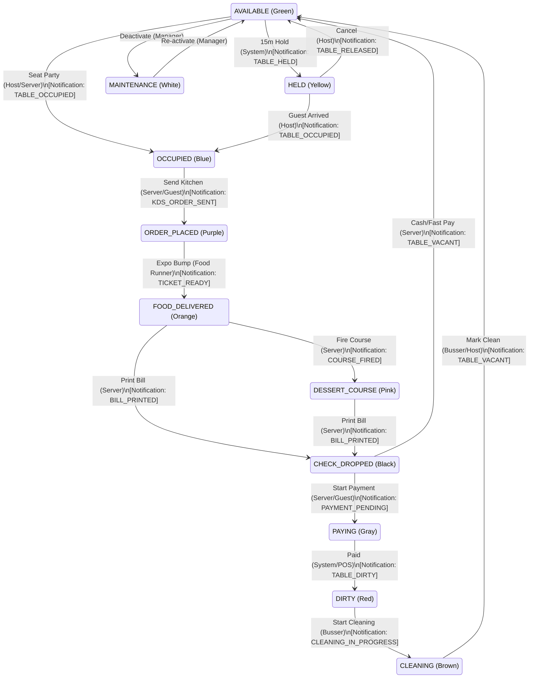

# Shopro POS Memory File

This file serves as a persistent reference for complex business logic, state machines, and cross-component architectures.

## Table State Machine & Notification Flow

The table dining lifecycle consists of an 11-state machine. Transitions are triggered by specific staff roles or automated system processes.

### State Definitions & Actors

| Current State | Next State | Triggering Actor | Event / Action | Notification | Recipients |
| :--- | :--- | :--- | :--- | :--- | :--- |
| **AVAILABLE** | **HELD** | **System** | 15 min before reservation | `TABLE_HELD` | Host, Manager |
| **AVAILABLE** | **OCCUPIED** | **Host / Server**| Seating a party manually | `TABLE_OCCUPIED`| Assigned Server |
| **HELD** | **OCCUPIED** | **Host** | Guest for reservation arrived| `TABLE_OCCUPIED`| Assigned Server |
| **OCCUPIED** | **ORDER_PLACED**| **Server / Guest**| "Send to Kitchen" action | `KDS_ORDER_SENT` | Kitchen Staff |
| **ORDER_PLACED**| **FOOD_DELIVERED**| **Food Runner** | Bumping ticket at Expo | `TICKET_READY` | Server, Runner |
| **FOOD_DELIVERED**| **DESSERT_COURSE**| **Server** | Firing a dessert course | `COURSE_FIRED` | Kitchen (Pastry) |
| **FOOD/DESSERT**| **CHECK_DROPPED**| **Server** | Printing the bill | `BILL_PRINTED` | Host Stand |
| **CHECK_DROPPED**| **PAYING** | **Server / Guest**| Swiping card / Initiating pay | `PAYMENT_PENDING`| N/A |
| **PAYING** | **DIRTY** | **System** | Payment Authorization OK | `TABLE_DIRTY` | Bussers |
| **DIRTY** | **CLEANING** | **Busser** | Starting the reset process | `CLEANING_IN_PROG`| N/A |
| **CLEANING** | **AVAILABLE** | **Busser / Host** | Marking table ready | `TABLE_VACANT` | Hosts |

### Key Notification Recipients Summary
- **Servers:** `TABLE_OCCUPIED`, `TICKET_READY`, `CALL_BUTTON`
- **Hosts:** `TABLE_HELD`, `TABLE_VACANT`, `BILL_PRINTED`, `VIP_ALERT`
- **Bussers:** `TABLE_DIRTY`
- **Kitchen:** `KDS_ORDER_SENT`, `COURSE_FIRED`
- **Food Runners:** `TICKET_READY`
