# 🖥️ Next-Gen Restaurant IMS — Screen Designs (Mermaid)
### UI/UX Blueprint: Every Screen Required to Fulfil the Full Specification

---

> **Document Type:** Screen Architecture & UI Flow Specification  
> **Companion To:** `NextGen_Restaurant_IMS.md` v1.1  
> **Rendering:** All diagrams use Mermaid. Render in GitHub, Notion, VS Code (Mermaid extension), or mermaid.live  
> **Versioning:** v1.0

---

## Table of Contents

1. [Navigation & Role-Based Shell](#1-navigation--role-based-shell)
2. [S01 — Main Dashboard (Home)](#2-s01--main-dashboard-home)
3. [S02 — Inventory Browser](#3-s02--inventory-browser)
4. [S03 — SKU Detail & Configuration](#4-s03--sku-detail--configuration)
5. [S04 — Batch Detail & Expiry Tracker](#5-s04--batch-detail--expiry-tracker)
6. [S05 — Daily Perishables Panel](#6-s05--daily-perishables-panel)
7. [S06 — Restocking Mode Configuration](#7-s06--restocking-mode-configuration)
8. [S07 — Receiving Workflow](#8-s07--receiving-workflow)
9. [S08 — Purchase Order List](#9-s08--purchase-order-list)
10. [S09 — Purchase Order Detail (Manual PO Review)](#10-s09--purchase-order-detail-manual-po-review)
11. [S10 — Auction List (All Auctions)](#11-s10--auction-list-all-auctions)
12. [S11 — Create Ad-Hoc Auction (Step Wizard)](#12-s11--create-ad-hoc-auction-step-wizard)
13. [S12 — Live Auction Detail](#13-s12--live-auction-detail)
14. [S13 — Bid Scoring & Award Screen](#14-s13--bid-scoring--award-screen)
15. [S14 — Supplier List & Scorecard](#15-s14--supplier-list--scorecard)
16. [S15 — Supplier Detail & Lead Time History](#16-s15--supplier-detail--lead-time-history)
17. [S16 — Expiry Monitor](#17-s16--expiry-monitor)
18. [S17 — Waste & Donation Log](#18-s17--waste--donation-log)
19. [S18 — Forecasting Dashboard](#19-s18--forecasting-dashboard)
20. [S19 — Alerts & Notifications Centre](#20-s19--alerts--notifications-centre)
21. [S20 — Analytics & Reports Hub](#21-s20--analytics--reports-hub)
22. [S21 — System Configuration (Admin)](#22-s21--system-configuration-admin)
23. [S22 — Supplier Portal (Supplier-Facing)](#23-s22--supplier-portal-supplier-facing)
24. [S23 — Mobile App — Staff View](#24-s23--mobile-app--staff-view)
25. [S24 — Mobile App — Manager View](#25-s24--mobile-app--manager-view)
26. [Full Navigation Map](#26-full-navigation-map)

---

## 1. Navigation & Role-Based Shell

The top-level nav adapts based on role. What is visible in the sidebar depends on the logged-in user's RBAC role.

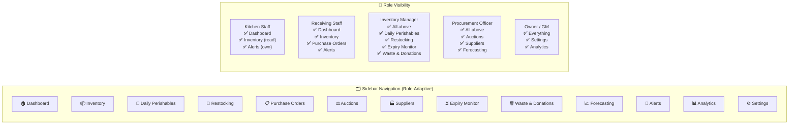

---

## 2. S01 — Main Dashboard (Home)

Satisfies: Real-time stock overview, daily perishable status, active auctions, pending alerts, in-transit POs, expiry timeline.

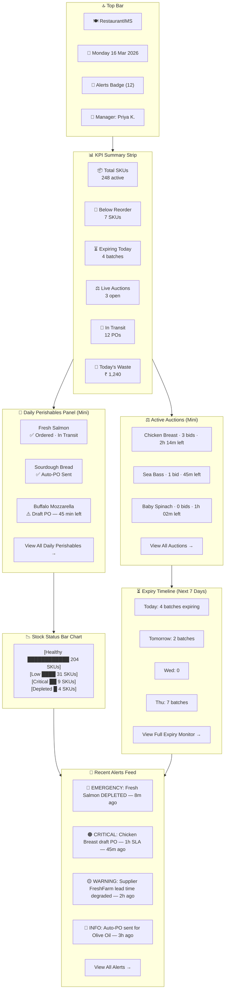

---

## 3. S02 — Inventory Browser

Satisfies: Real-time stock levels, FIFO view, category filter, daily perishable flag, restocking mode visibility, days-of-stock indicator.

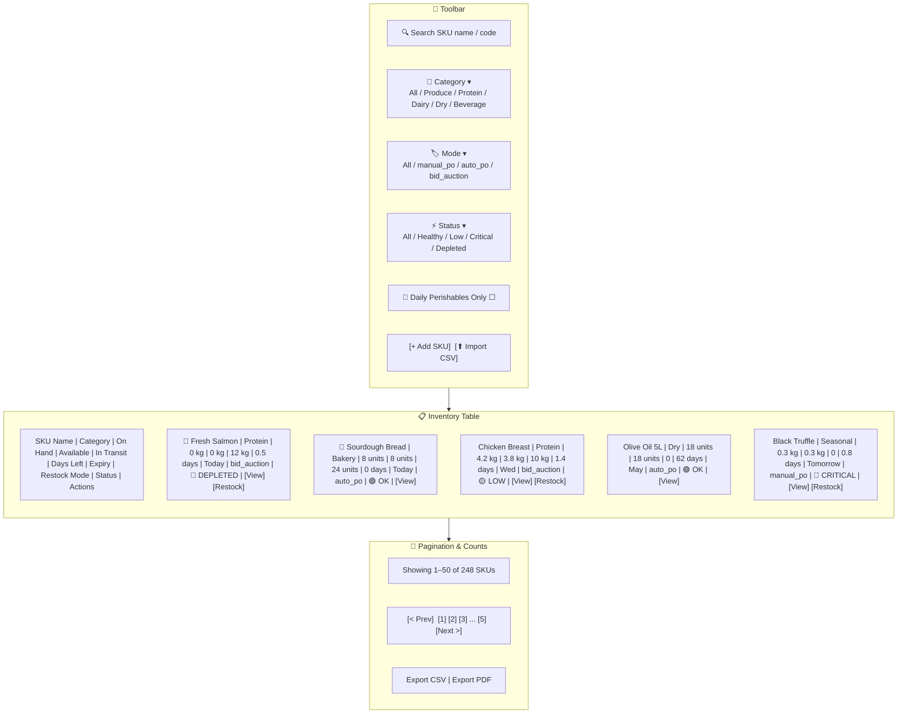

---

## 4. S03 — SKU Detail & Configuration

Satisfies: Shelf-life config, restocking mode config, supplier pool for bidding, daily perishable enrolment, par level, reorder point, safety stock, supplier assignment.

```mermaid
graph TB
    subgraph HEADER_SKU["📦 SKU Header"]
        SK1["Fresh Salmon (SKU-0042)"]
        SK2["Category: Protein | Unit: kg | Storage: Refrigerated"]
        SK3["🌅 Daily Perishable (shelf_life_days = 1)"]
        SK4["[Edit SKU]  [Deactivate]  [View Batches]  [View History]"]
    end

    subgraph TAB_STOCK["📊 Tab: Stock & Thresholds"]
        TS1["Par Level: 20 kg"]
        TS2["Reorder Point: 5 kg"]
        TS3["Safety Stock: 3 kg (auto-computed)"]
        TS4["Current On Hand: 0 kg 🔴"]
        TS5["In Transit: 12 kg (PO-7721)"]
        TS6["Days of Stock: 0.5 days"]
    end

    subgraph TAB_SHELFLIFE["⏱️ Tab: Shelf Life & Expiry"]
        SL1["Shelf Life: 1 day"]
        SL2["Daily Perishable: ✅ AUTO-SET (immutable)"]
        SL3["Daily Restock Enrolled: ✅ YES (forced by shelf_life_days=1)"]
        SL4["Warning Threshold: 4 hours before expiry"]
        SL5["Critical Threshold: 1 hour before expiry"]
        SL6["Use-by Strict: ✅ Yes — auto-discard at midnight"]
        SL7["Midnight Expiry Job: Enabled"]
        SL8["Donation Partner: FoodBank Kerala ✅ Configured"]
    end

    subgraph TAB_RESTOCK["🔄 Tab: Restocking Mode"]
        RM1["Restocking Mode: ● bid_auction"]
        RM2["○ manual_po  ○ auto_po  ● bid_auction"]
        RM3["--- Bid Auction Settings ---"]
        RM4["Bid Supplier Pool: ○ All Eligible  ● Custom List"]
        RM5["Custom Pool: FreshFarm Co., OceanDirect, AquaSupplies"]
        RM6["[+ Add Supplier]  [Remove]"]
        RM7["Auction Window: 3 hours (perishable default)"]
        RM8["Auto-Award: ✅ Yes (score gap > 10 pts)"]
        RM9["Price Ceiling: ₹ 850 / kg"]
        RM10["Min Quality Grade: A"]
    end

    subgraph TAB_SUPPLIERS["🏭 Tab: Supplier Assignment"]
        SUP1["Primary Supplier: OceanDirect ⭐ 4.8 | Avg LT: 0.8 days"]
        SUP2["Backup 1: FreshFarm Co. ⭐ 4.2 | Avg LT: 1.2 days"]
        SUP3["Backup 2: AquaSupplies ⭐ 3.9 | Avg LT: 1.5 days"]
        SUP4["Emergency: FastFish Express ⭐ 4.0 | Avg LT: 0.5 days"]
        SUP5["[Edit Suppliers]"]
    end

    subgraph TAB_HISTORY["📜 Tab: History"]
        HI1["Recent StockEvents (last 30 days)"]
        HI2["Date | Type | Qty | Supplier / User | Batch"]
        HI3["15 Mar | receive | +18 kg | OceanDirect | B-8812"]
        HI4["15 Mar | consume | -18 kg | POS Auto | B-8812"]
        HI5["14 Mar | expire | -0.3 kg | System | B-8809"]
        HI6["[Load More]"]
    end

    HEADER_SKU --> TAB_STOCK
    TAB_STOCK --> TAB_SHELFLIFE
    TAB_SHELFLIFE --> TAB_RESTOCK
    TAB_RESTOCK --> TAB_SUPPLIERS
    TAB_SUPPLIERS --> TAB_HISTORY
```

---

## 5. S04 — Batch Detail & Expiry Tracker

Satisfies: FIFO visibility, per-batch expiry, partial usage tracking, status lifecycle, cold chain breach flag.

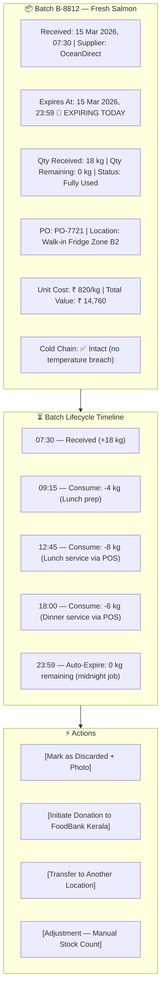

---

## 6. S05 — Daily Perishables Panel

Satisfies: 1-day shelf-life auto-enrolment, today's mandatory restock status per perishable SKU, quantity ordered vs. forecasted demand, SLA countdown for manual_po drafts.

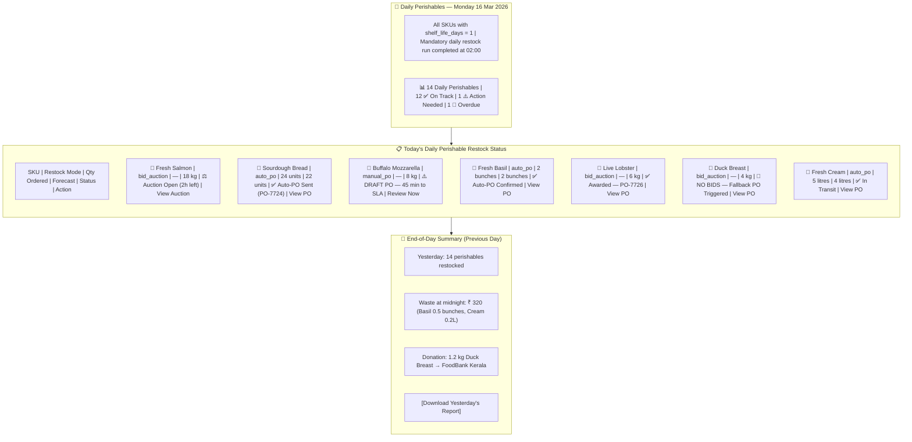

---

## 7. S06 — Restocking Mode Configuration

Satisfies: Per-SKU mode assignment (manual_po / auto_po / bid_auction), bulk configuration, bid pool setup, auction window settings, auto-award toggle.

```mermaid
graph TB
    subgraph RM_HEADER["🔄 Restocking Mode Configuration"]
        RMH1["Configure how each SKU is fulfilled when a restock is triggered"]
        RMH2["[⬆ Import CSV]  [⬇ Export CSV]  [Apply Bulk Mode Change]"]
    end

    subgraph RM_FILTER["🔍 Filters"]
        RF1["Category ▾ | Mode ▾ | Shelf Life ▾ | Search SKU"]
    end

    subgraph RM_TABLE["📋 Mode Configuration Table"]
        TH["SKU | Shelf Life | Current Mode | Bid Pool | Auto-Award | Price Ceiling | Auction Window | Edit"]
        R1["Fresh Salmon | 1 day | bid_auction | Custom (3 suppliers) | ✅ Yes | ₹850/kg | 3h | ✏️"]
        R2["Sourdough Bread | 1 day | auto_po | — | — | ±10% avg | — | ✏️"]
        R3["Chicken Breast | 2 days | bid_auction | All Eligible | ❌ No | ₹420/kg | 4h | ✏️"]
        R4["Olive Oil 5L | 180 days | auto_po | — | — | ±10% avg | — | ✏️"]
        R5["Black Truffle | 3 days | manual_po | — | — | — | — | ✏️"]
        R6["Napkins 500pk | 365 days | auto_po | — | — | ±10% avg | — | ✏️"]
    end

    subgraph RM_INLINE_EDIT["✏️ Inline Edit Drawer (per row)"]
        IE1["SKU: Fresh Salmon"]
        IE2["Restocking Mode: ○ manual_po  ○ auto_po  ● bid_auction"]
        IE3["--- If bid_auction ---"]
        IE4["Supplier Pool: ○ All Eligible  ● Custom List"]
        IE5["Selected: OceanDirect ✕ | FreshFarm ✕ | AquaSupplies ✕ | [+ Add]"]
        IE6["Auction Window: [3] hours"]
        IE7["Auto-Award: [✅] Yes — when score gap > [10] points"]
        IE8["Price Ceiling: ₹ [850] / kg"]
        IE9["Min Quality Grade: [A ▾]"]
        IE10["--- If manual_po ---"]
        IE11["Draft PO SLA: [2] hours (daily perishable) / [12] hours (standard)"]
        IE12["[Save Changes]  [Cancel]"]
    end

    RM_HEADER --> RM_FILTER
    RM_FILTER --> RM_TABLE
    RM_TABLE --> RM_INLINE_EDIT
```

---

## 8. S07 — Receiving Workflow

Satisfies: PO-matched receiving, batch creation with auto-calculated expiry, quantity mismatch detection, cold chain logging, location assignment.

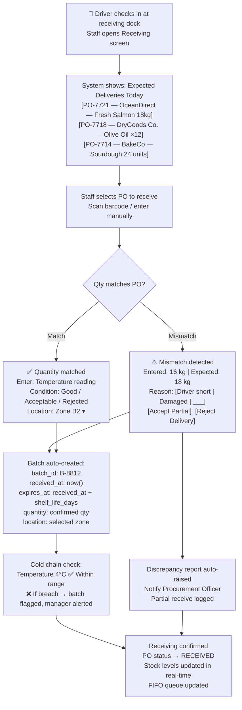

---

## 9. S08 — Purchase Order List

Satisfies: PO status tracking, filtering by order type and status, overdue PO highlights, manual vs. auto vs. bid-awarded PO visibility.

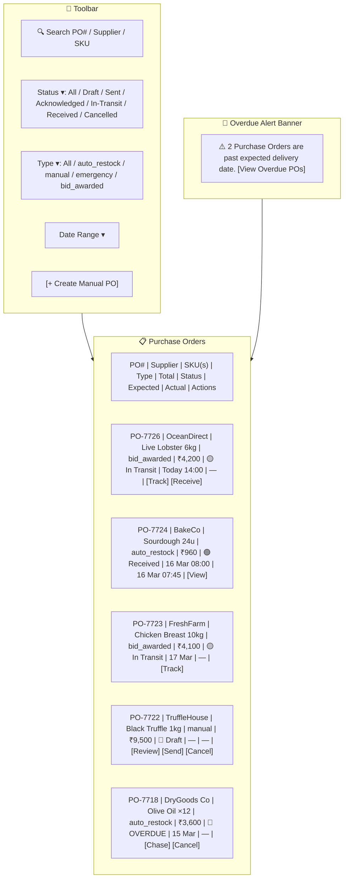

---

## 10. S09 — Purchase Order Detail (Manual PO Review)

Satisfies: Manual PO draft review and edit, supplier change, quantity change, price override, SLA countdown, split PO capability, send/cancel actions.

```mermaid
graph TB
    subgraph PO_DETAIL_HEADER["📋 PO-7722 — DRAFT — Black Truffle"]
        PDH1["Type: manual_po | Created by: System (restock trigger)"]
        PDH2["🔴 SLA: You have 1h 15m to send this PO (daily perishable SLA)"]
        PDH3["[Send PO]  [Save Draft]  [Cancel PO]  [Split into Multiple POs]"]
    end

    subgraph PO_SUPPLIER["🏭 Supplier Section"]
        PS1["Recommended: TruffleHouse ⭐ 4.6 | Avg LT: 2.1 days"]
        PS2["[Change Supplier ▾]"]
        PS3["Available alternatives: LuxuryProduce (4.4, 2.4d) | Foie & Co (4.1, 3.0d)"]
    end

    subgraph PO_LINES["📦 Order Lines"]
        PL1["SKU | Qty Recommended | Qty Override | Unit Price | Total"]
        PL2["Black Truffle | 1.0 kg | [1.0 kg  ✏️] | [₹9,500 ✏️] | ₹9,500"]
        PL3["[+ Add Another SKU to this PO]"]
        PL4["Total: ₹ 9,500"]
    end

    subgraph PO_DELIVERY["🚚 Delivery Details"]
        PD1["Requested Delivery Date: [17 Mar 2026 ▾]"]
        PD2["Delivery Address: Main Kitchen, 1st Floor"]
        PD3["Special Instructions: [_____________________]"]
    end

    subgraph PO_NOTES["📝 Notes & Approval"]
        PN1["Internal Notes: [_____________________]"]
        PN2["Approval Required: ✅ Yes (order > ₹5,000 threshold)"]
        PN3["Approved by: — (pending)"]
        PN4["[Request Approval]"]
    end

    PO_DETAIL_HEADER --> PO_SUPPLIER
    PO_SUPPLIER --> PO_LINES
    PO_LINES --> PO_DELIVERY
    PO_DELIVERY --> PO_NOTES
```

---

## 11. S10 — Auction List (All Auctions)

Satisfies: View all system and ad-hoc auctions, filter by type/status, create new ad-hoc auction, live bid counts, time remaining.

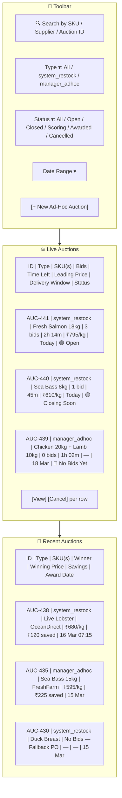

---

## 12. S11 — Create Ad-Hoc Auction (Step Wizard)

Satisfies: Manager-initiated auction with custom end time, multi-SKU selection, custom supplier pool options (All Eligible / Custom / Previous Winners / Preferred+Backups), auto-award config, delivery window.

```mermaid
flowchart TD
    START["Manager clicks '+ New Ad-Hoc Auction'"]

    subgraph STEP1["Step 1 of 4 — Select SKUs & Quantities"]
        S1A["🔍 Search and select SKUs"]
        S1B["SKU | Qty Required | Min Quality | Max Unit Price (ceiling)"]
        S1C["[Chicken Breast | 20 kg | A | ₹450/kg ✕]\n[Lamb Shoulder | 10 kg | A | ₹620/kg ✕]\n[+ Add Another SKU]"]
        S1D["[Next →]"]
    end

    subgraph STEP2["Step 2 of 4 — Auction Parameters"]
        S2A["Bid End Date & Time: [18 Mar 2026] [14:00] 📅"]
        S2B["Delivery Required By: [20 Mar 2026] 📅"]
        S2C["Delivery Window (days): [4 days] (auto-computed from dates, editable)"]
        S2D["Auto-Award: ● Yes (score gap > 10 pts)  ○ No (always require my approval)"]
        S2E["Award Notification: ✅ Email  ✅ In-App  ☐ SMS"]
        S2F["[← Back]  [Next →]"]
    end

    subgraph STEP3["Step 3 of 4 — Select Suppliers"]
        S3A["Supplier Pool:"]
        S3B["○ All Eligible\n   System invites all suppliers with\n   matching category + reliability ≥ 0.70"]
        S3C["● Custom List\n   Search and select specific suppliers"]
        S3D["○ Previous Winners\n   Suppliers who won auctions for\n   these SKUs in last 90 days"]
        S3E["○ Preferred + Backups\n   Auto-select from SKU supplier config"]
        S3F["--- If Custom List ---"]
        S3G["🔍 Search suppliers by name / category / tier"]
        S3H["Selected: FreshFarm Co. ⭐4.2 LT:2d ✕ | OceanDirect ⭐4.8 LT:1d ✕ | MeatPrime ⭐4.5 LT:1.5d ✕"]
        S3I["[+ Add Supplier]"]
        S3J["Preview: 3 suppliers will be invited"]
        S3K["[← Back]  [Next →]"]
    end

    subgraph STEP4["Step 4 of 4 — Review & Launch"]
        S4A["📋 Summary"]
        S4B["SKUs: Chicken Breast 20kg, Lamb Shoulder 10kg"]
        S4C["Bid Deadline: 18 Mar 2026 14:00"]
        S4D["Delivery By: 20 Mar 2026"]
        S4E["Suppliers: FreshFarm Co., OceanDirect, MeatPrime"]
        S4F["Auto-Award: Yes (gap > 10 pts)"]
        S4G["Price Ceilings: Chicken ₹450/kg | Lamb ₹620/kg"]
        S4H["Optional invitation note:\n[e.g. 'Please include cold-chain cert with bid'] 📝"]
        S4I["[← Back]  [🚀 Launch Auction]  [Save as Draft]"]
    end

    CONFIRM["✅ Auction AUC-441 Created\nInvitations sent to 3 suppliers\n[View Auction]  [Back to Auction List]"]

    START --> STEP1
    STEP1 --> STEP2
    STEP2 --> STEP3
    STEP3 --> STEP4
    STEP4 --> CONFIRM
```

---

## 13. S12 — Live Auction Detail

Satisfies: Real-time bid tracking, time remaining, supplier participation, leading bid, bid withdrawal/update by supplier, manager ability to cancel or extend.

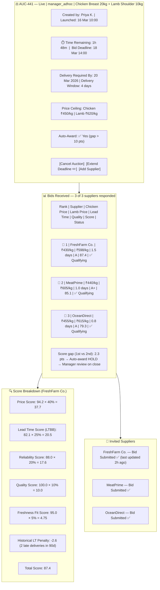

---

## 14. S13 — Bid Scoring & Award Screen

Satisfies: Manager review of close-race auctions, side-by-side comparison, manual award override, reject all bids, fallback PO.

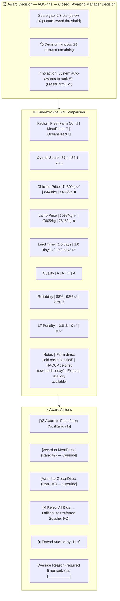

---

## 15. S14 — Supplier List & Scorecard

Satisfies: Supplier management, reliability scoring, lead time tiers, blacklist management, bid eligibility filter.

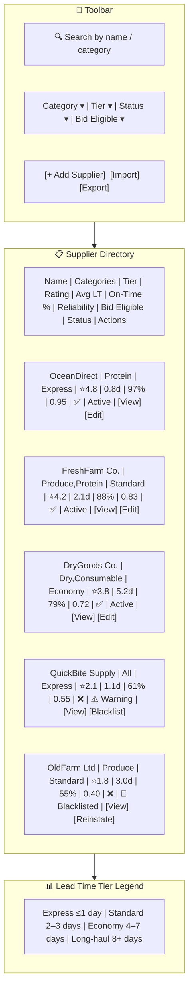

---

## 16. S15 — Supplier Detail & Lead Time History

Satisfies: Full supplier profile, rolling lead time stats, per-SKU lead time breakdown, bid history, blacklist/warning actions.

```mermaid
graph TB
    subgraph SUP_PROFILE["🏭 FreshFarm Co. — Supplier Profile"]
        SP1["Categories: Produce, Protein | Tier: Standard | Rating: ⭐ 4.2"]
        SP2["Contact: orders@freshfarm.in | Integration: REST API"]
        SP3["Min Order: ₹2,000 | Payment Terms: Net 30"]
        SP4["Cold Chain Certified: ✅ | FSSAI Licensed: ✅"]
        SP5["Bid Eligible: ✅ | Status: Active"]
        SP6["[Edit Profile]  [Set Performance Warning]  [Blacklist]  [Remove from Bid Pool]"]
    end

    subgraph SUP_STATS["📊 Rolling Lead Time Statistics (Last 90 Days)"]
        SS1["Avg Lead Time: 2.1 days"]
        SS2["P95 Lead Time: 3.4 days"]
        SS3["Lead Time Variance (σ): 0.6 days"]
        SS4["On-Time Delivery Rate: 88%"]
        SS5["Reliability Score: 0.83"]
        SS6["Late Deliveries: 4 | Early: 6 | On Time: 32"]
        SS7["LT Trend: ⬆ +0.3d vs last 30d ⚠️"]
    end

    subgraph SUP_LT_PERSKU["📋 Lead Time by SKU"]
        LH["SKU | Avg LT | P95 LT | On-Time % | Last Delivery | Trend"]
        LR1["Fresh Salmon | 1.8d | 2.9d | 91% | 15 Mar | ✅ Stable"]
        LR2["Chicken Breast | 2.3d | 3.8d | 85% | 14 Mar | ⚠️ Degrading"]
        LR3["Baby Spinach | 1.2d | 1.8d | 94% | 16 Mar | ✅ Stable"]
    end

    subgraph SUP_BID_HISTORY["⚖️ Bid Auction History"]
        BH["Auction | SKU | Bid Price | Won? | Proposed LT | Actual LT | Deviation"]
        BR1["AUC-435 | Sea Bass | ₹595/kg | ✅ Won | 1.5d | 1.7d | +0.2d"]
        BR2["AUC-430 | Duck Breast | ₹410/kg | ❌ Lost | 2.0d | — | —"]
        BR3["AUC-421 | Chicken | ₹435/kg | ✅ Won | 2.0d | 2.8d | +0.8d ⚠️"]
    end

    SUP_PROFILE --> SUP_STATS
    SUP_STATS --> SUP_LT_PERSKU
    SUP_LT_PERSKU --> SUP_BID_HISTORY
```

---

## 17. S16 — Expiry Monitor

Satisfies: All-batches expiry view, urgent usage tasks, daily perishable midnight expiry tracker, warning/critical/expired status, donation initiation.

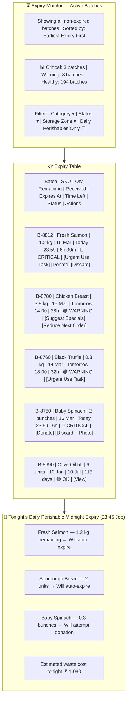

---

## 18. S17 — Waste & Donation Log

Satisfies: Waste cost tracking by SKU/supplier/date, donation partner management, photographic discard evidence, waste trend analysis.

```mermaid
graph TB
    subgraph WASTE_HEADER["🗑️ Waste & Donation Log"]
        WH1["Date Range: [Last 7 Days ▾]  Category ▾  Supplier ▾  Type ▾: Waste / Donation / Both"]
        WH2["📊 Total Waste This Week: ₹ 6,840 | Total Donated: ₹ 1,200 (est. tax value)"]
    end

    subgraph WASTE_TABLE["📋 Events Log"]
        TH["Date | SKU | Batch | Qty | Type | Value | Supplier | Reason | Evidence"]
        R1["16 Mar | Fresh Salmon | B-8800 | 0.5 kg | 🔴 Waste | ₹410 | OceanDirect | Midnight expiry | —"]
        R2["16 Mar | Baby Spinach | B-8795 | 1 bunch | 🟢 Donation | ₹80 | FreshFarm | Near-expiry | FoodBank Pickup ✅"]
        R3["15 Mar | Black Truffle | B-8750 | 0.1 kg | 🔴 Waste | ₹950 | TruffleHouse | Midnight expiry | 📷 Photo"]
        R4["15 Mar | Sourdough | B-8780 | 3 units | 🔴 Waste | ₹90 | BakeCo | Midnight expiry | —"]
    end

    subgraph WASTE_ANALYTICS["📊 Waste Analytics"]
        WA1["Top 5 Wasted SKUs (by cost, this month)"]
        WA2["1. Black Truffle — ₹4,750 | 2. Fresh Salmon — ₹3,280\n3. Duck Breast — ₹2,100 | 4. Sourdough — ₹640\n5. Baby Spinach — ₹510"]
        WA3["Waste by Supplier: OceanDirect 28% | FreshFarm 22% | TruffleHouse 35%"]
        WA4["💡 Suggestion: Reduce Fresh Salmon par level by 2 kg (based on 7-day waste trend)"]
    end

    subgraph DONATION_PARTNERS["🤝 Donation Partners"]
        DP1["FoodBank Kerala — Same-day pickup ✅ | Contact: 9876543210"]
        DP2["Community Kitchen — 2-hour notice required"]
        DP3["[+ Add Partner]  [Edit]"]
    end

    WASTE_HEADER --> WASTE_TABLE
    WASTE_TABLE --> WASTE_ANALYTICS
    WASTE_ANALYTICS --> DONATION_PARTNERS
```

---

## 19. S18 — Forecasting Dashboard

Satisfies: SKU-level demand forecasts, confidence intervals, demand drivers, model accuracy, BOM-linked cover-to-ingredient translation.

```mermaid
graph TB
    subgraph FORECAST_HEADER["📈 Demand Forecasting Dashboard"]
        FH1["SKU: [Fresh Salmon ▾] | View: [Next 7 Days ▾] | Model: Ensemble (LSTM + XGBoost)"]
        FH2["Model Confidence: 0.88 | Last Retrained: Today 01:30 | MAPE (7-day): 6.2%"]
    end

    subgraph FORECAST_CHART["📊 Demand Forecast Chart (Next 7 Days)"]
        FC1["Day | Predicted | Lower Bound | Upper Bound | Actual (if past)"]
        FC2["Mon 16 | 18 kg | 15 kg | 22 kg | 17.8 kg ✅"]
        FC3["Tue 17 | 20 kg | 16 kg | 25 kg | —"]
        FC4["Wed 18 | 24 kg | 19 kg | 30 kg | — ⚡ High demand (Private event)"]
        FC5["Thu 19 | 19 kg | 15 kg | 23 kg | —"]
        FC6["Fri 20 | 28 kg | 22 kg | 35 kg | — 📅 Weekend peak"]
        FC7["Sat 21 | 32 kg | 25 kg | 40 kg | — 📅 Weekend peak"]
        FC8["Sun 22 | 22 kg | 17 kg | 28 kg | —"]
    end

    subgraph FORECAST_DRIVERS["🔍 Demand Drivers (Top 5 — This Week)"]
        FD1["1. Weekend effect (+38%)"]
        FD2["2. Private event Wed (+15%)"]
        FD3["3. Seasonal peak (summer, +8%)"]
        FD4["4. Salmon special on menu (+6%)"]
        FD5["5. Weather: hot (+3% seafood demand)"]
    end

    subgraph FORECAST_SAFETY["🛡️ Dynamic Safety Stock"]
        FS1["Current safety stock: 3 kg (standard)"]
        FS2["Fri–Sat recommended safety stock: 6 kg (high-demand period)"]
        FS3["System will auto-adjust Fri/Sat restocking quantity ✅"]
    end

    subgraph FORECAST_BOM["🍽️ BOM Coverage (Dishes using Fresh Salmon)"]
        FB1["Salmon Tartare — 120g per serving — forecasted 45 covers Wed"]
        FB2["Grilled Salmon — 200g per serving — forecasted 80 covers Fri"]
        FB3["Total BOM-driven demand Fri: 200×80×0.2 + 45×0.12 = 21.4 kg"]
    end

    FORECAST_HEADER --> FORECAST_CHART
    FORECAST_CHART --> FORECAST_DRIVERS
    FORECAST_DRIVERS --> FORECAST_SAFETY
    FORECAST_SAFETY --> FORECAST_BOM
```

---

## 20. S19 — Alerts & Notifications Centre

Satisfies: All alert types (inventory, ordering, auction, supplier), severity levels, acknowledgement, escalation status, multi-channel delivery status.

```mermaid
graph TB
    subgraph ALERT_TOOLBAR["🔔 Alerts Centre"]
        AT1["Filter: All / Unread / Acknowledged / Escalated"]
        AT2["Severity ▾: All / INFO / WARNING / CRITICAL / EMERGENCY"]
        AT3["Category ▾: Inventory / Ordering / Auction / Supplier"]
        AT4["[Mark All Read]  [Export Log]"]
        AT5["📊 Unread: 12 | EMERGENCY: 1 | CRITICAL: 3 | WARNING: 8"]
    end

    subgraph ALERT_LIST["📋 Alert Feed (Latest First)"]
        AL1["🔴 EMERGENCY | STOCK_DEPLETED | Fresh Salmon — 0 kg available\n→ Emergency supplier notified | 8m ago | [Acknowledge] [View SKU]"]
        AL2["🟠 CRITICAL | PO_DRAFT_PENDING | Black Truffle manual_po draft — 45m to SLA expiry\n→ If not actioned: auto-escalate to GM | 45m ago | [Review PO Now]"]
        AL3["🟠 CRITICAL | PO_OVERDUE | PO-7718 from DryGoods Co. — 1 day overdue\n→ [Chase Supplier] [Cancel & Re-order] | 1h ago | [View PO]"]
        AL4["🟠 CRITICAL | AUCTION_NO_BIDS | AUC-430 Duck Breast — no bids, fallback PO triggered\n| 3h ago | [View PO] [Acknowledged ✅]"]
        AL5["🟡 WARNING | SUPPLIER_LEAD_TIME_DEGRADED | FreshFarm Co. avg LT +0.3d in 30d\n| 4h ago | [View Supplier]"]
        AL6["🟡 WARNING | EXPIRY_CRITICAL | B-8812 Fresh Salmon — 6h 30m remaining\n→ Urgent use task created | 2h ago | [View Batch]"]
        AL7["🟡 WARNING | AUCTION_PENDING_AWARD | AUC-441 — score gap 2.3 pts, needs review\n→ 28 min to auto-award | 30m ago | [Review Now]"]
        AL8["🔵 INFO | AUTO_PO_SENT | Sourdough Bread — Auto-PO raised to BakeCo\n→ 15-min cancellation window | 1h ago | [Cancel PO]"]
        AL9["🔵 INFO | AUCTION_AWARDED_AUTO | AUC-438 Live Lobster — awarded to OceanDirect ₹680/kg\n| 4h ago | [View Auction]"]
    end

    subgraph ALERT_DETAIL["🔍 Alert Detail Drawer (expand any row)"]
        AD1["Alert: PO_DRAFT_PENDING | ID: ALT-9902"]
        AD2["SKU: Black Truffle | PO: PO-7722 | Supplier: TruffleHouse"]
        AD3["Created: 16 Mar 09:30 | SLA: 11:30 (45 min remaining)"]
        AD4["Delivery Channels: ✅ In-App | ✅ Email sent 09:30 | ⏳ SMS (if unacked by 11:00)"]
        AD5["Escalation: Will notify GM at 11:30 if unacknowledged"]
        AD6["[Review Draft PO]  [Acknowledge]  [Suppress for 30 min]"]
    end

    ALERT_TOOLBAR --> ALERT_LIST
    ALERT_LIST --> ALERT_DETAIL
```

---

## 21. S20 — Analytics & Reports Hub

Satisfies: Daily/weekly/monthly reports, waste analytics, auction savings, supplier scorecard, forecast accuracy, restocking mode ROI.

```mermaid
graph TB
    subgraph ANALYTICS_HEADER["📊 Analytics & Reports Hub"]
        AH1["Report Type ▾ | Date Range ▾ | Category ▾ | [Generate] [Schedule] [Export PDF]"]
    end

    subgraph ANALYTICS_TABS["📂 Report Categories"]
        TAB1["📦 Inventory Turnover"]
        TAB2["🗑️ Waste & Shrinkage"]
        TAB3["⚖️ Auction Performance"]
        TAB4["🏭 Supplier Scorecards"]
        TAB5["📈 Forecast Accuracy"]
        TAB6["🔄 Restocking Mode ROI"]
        TAB7["💸 Cost Analysis"]
    end

    subgraph WASTE_REPORT["🗑️ Waste Report (Sample)"]
        WR1["Period: Last 30 Days"]
        WR2["Total Waste Cost: ₹ 28,400"]
        WR3["Top Category: Protein (₹14,200 — 50%)"]
        WR4["Top SKU: Black Truffle ₹9,500"]
        WR5["Waste-to-Purchase Ratio: 4.2%"]
        WR6["vs. Last Month: +0.8% ⚠️"]
        WR7["💡 System Tip: Reduce Black Truffle par level from 1kg to 0.6kg"]
    end

    subgraph AUCTION_REPORT["⚖️ Auction Performance (Sample)"]
        AR1["Period: Last 30 Days | Total Auctions: 42"]
        AR2["system_restock: 38 | manager_adhoc: 4"]
        AR3["Auctions with bids: 40 (95%) | No-bid fallbacks: 2"]
        AR4["Total Savings vs. Catalogue: ₹ 18,640"]
        AR5["Avg Savings per Auction: ₹ 466"]
        AR6["Best Performing SKU: Fresh Salmon (₹120/kg avg saving)"]
        AR7["Most Active Supplier: FreshFarm Co. (18 bids, 11 wins)"]
    end

    subgraph RESTOCK_ROI["🔄 Restocking Mode ROI (Sample)"]
        RR1["auto_po SKUs: Avg cost deviation +1.2% (within threshold ✅)"]
        RR2["bid_auction SKUs: Avg 8.4% below catalogue price ✅"]
        RR3["manual_po SKUs: Avg SLA compliance 82% ⚠️"]
        RR4["💡 Recommendation: Switch Chicken Breast from bid_auction-no-auto to bid_auction-auto\n(consistent winner, score gap avg 18 pts)"]
    end

    ANALYTICS_HEADER --> ANALYTICS_TABS
    ANALYTICS_TABS --> WASTE_REPORT
    ANALYTICS_TABS --> AUCTION_REPORT
    ANALYTICS_TABS --> RESTOCK_ROI
```

---

## 22. S21 — System Configuration (Admin / GM)

Satisfies: Global thresholds, alert SLAs, auto-award defaults, daily perishable suppression rules, integration settings, RBAC user management.

```mermaid
graph TB
    subgraph CONFIG_TABS["⚙️ System Configuration"]
        CT1["🏢 Restaurant Profile"]
        CT2["🔔 Alert & Escalation Rules"]
        CT3["⚖️ Bidding Defaults"]
        CT4["🔄 Restocking Defaults"]
        CT5["🔗 Integrations"]
        CT6["👥 Users & Roles"]
        CT7["💰 Financial Controls"]
        CT8["🤝 Donation Partners"]
    end

    subgraph ALERT_CONFIG["🔔 Alert & Escalation Config"]
        AC1["manual_po SLA (daily perishable): [30] minutes"]
        AC2["manual_po SLA (standard SKU): [12] hours"]
        AC3["Escalation: WARNING → CRITICAL after [4] hours"]
        AC4["Escalation: CRITICAL → Emergency contact after [1] hour"]
        AC5["EMERGENCY SMS recipients: [+91-XXXXXXXX] [+ Add]"]
    end

    subgraph BID_DEFAULTS["⚖️ Bidding Defaults"]
        BD1["Default auction window (perishables): [3] hours"]
        BD2["Default auction window (dry goods): [12] hours"]
        BD3["Auto-award score gap threshold: [10] points"]
        BD4["Emergency auction window: [1] hour"]
        BD5["Min supplier reliability for invitation: [0.70]"]
        BD6["Price ceiling anomaly threshold (auto_po): [±10]%"]
        BD7["Score weight presets by category: [Edit weights ▾]"]
    end

    subgraph RESTOCK_DEFAULTS["🔄 Restocking Defaults"]
        RD1["Daily perishable midnight expiry job: ✅ Enabled | Time: [23:45]"]
        RD2["Daily perishable suppression: ❌ Not allowed without GM override"]
        RD3["Manager quantity override limit: [±30]% of computed qty"]
        RD4["Emergency supplier auto-invite on emergency restock: ✅ Enabled"]
        RD5["Safety stock service level (Z): [1.65] (95th percentile)"]
        RD6["Rolling demand window for safety stock: [14] days"]
    end

    subgraph FINANCIAL_CONFIG["💰 Financial Controls"]
        FC1["Dual approval threshold: ₹ [5,000]"]
        FC2["Auto-PO max value without approval: ₹ [2,000]"]
        FC3["Price ceiling override: GM only ✅"]
        FC4["Audit log retention: [3] years"]
    end

    CONFIG_TABS --> ALERT_CONFIG
    CONFIG_TABS --> BID_DEFAULTS
    CONFIG_TABS --> RESTOCK_DEFAULTS
    CONFIG_TABS --> FINANCIAL_CONFIG
```

---

## 23. S22 — Supplier Portal (Supplier-Facing)

Satisfies: Supplier bid submission, bid update/withdrawal, auction list visibility, lead time confirmation on POs, performance self-view.

```mermaid
graph TB
    subgraph SP_HEADER["🏭 OceanDirect — Supplier Portal"]
        SPH1["Welcome, OceanDirect | Role: Supplier"]
        SPH2["📊 Active Invitations: 2 | Awarded POs: 1 | Open POs: 3"]
    end

    subgraph SP_AUCTIONS["⚖️ Active Auction Invitations"]
        SAH["Auction | SKU | Qty | Delivery By | Deadline | My Bid | Status"]
        SA1["AUC-441 | Chicken 20kg + Lamb 10kg | 20 Mar | 18 Mar 14:00 | ₹455/kg, ₹615/kg | 🥉 Rank 3 | [Update Bid] [Withdraw]"]
        SA2["AUC-442 | Baby Spinach 5 bunches | 17 Mar | 16 Mar 18:00 | No bid yet | New | [Submit Bid]"]
    end

    subgraph SP_BID_FORM["📝 Submit / Update Bid — AUC-441"]
        SBF1["Chicken Breast: Unit Price ₹ [455 ✏️] / kg | Quantity: [20 kg]"]
        SBF2["Lamb Shoulder: Unit Price ₹ [615 ✏️] / kg | Quantity: [10 kg]"]
        SBF3["Proposed Lead Time: [1] day(s)"]
        SBF4["Quality Grade: [A ▾]"]
        SBF5["Cold Chain Certified: ✅ Yes"]
        SBF6["Bid Validity: [8] hours after submission"]
        SBF7["Notes: [_______________]"]
        SBF8["[Submit Bid]  [Save Draft]  [Withdraw Bid]"]
    end

    subgraph SP_POS["📋 My Purchase Orders"]
        SPO1["PO-7726 | Live Lobster 6kg | ₹4,080 | Expected: Today 14:00 | [Confirm Dispatch] [Update ETA]"]
        SPO2["PO-7720 | Fresh Salmon 18kg | ₹14,760 | Delivered ✅ 15 Mar | [View]"]
    end

    subgraph SP_PERFORMANCE["📊 My Performance (Self-View)"]
        SPP1["On-Time Delivery: 97% ✅ | Avg Lead Time: 0.8 days ✅"]
        SPP2["Bid Win Rate: 68% | Total Orders (90d): 28"]
        SPP3["Platform Rating: ⭐ 4.8"]
    end

    SP_HEADER --> SP_AUCTIONS
    SP_AUCTIONS --> SP_BID_FORM
    SP_BID_FORM --> SP_POS
    SP_POS --> SP_PERFORMANCE
```

---

## 24. S23 — Mobile App — Staff View

Satisfies: Kitchen staff stock check, prep consumption logging, receiving dock scanning.

```mermaid
graph TB
    subgraph MOB_STAFF["📱 Staff Mobile App"]
        direction TB
        MSH["Staff: Rahul K. | Role: Kitchen Staff | Mon 16 Mar"]
    end

    subgraph MOB_HOME["🏠 Home Screen"]
        MH1["📦 My Tasks (3)"]
        MH2["⚠️ Urgent: Use Fresh Salmon before 23:59"]
        MH3["⚠️ Urgent: Use Baby Spinach — 6h left"]
        MH4["✅ Receive PO-7724 at Dock"]
    end

    subgraph MOB_STOCK["📦 Quick Stock Check"]
        MS1["🔍 Scan barcode or search SKU"]
        MS2["Result: Fresh Salmon\nOn Hand: 1.2 kg | Expires: Tonight\nLocation: Fridge Zone B2"]
        MS3["[Log Consumption]"]
    end

    subgraph MOB_CONSUME["📝 Log Consumption"]
        MC1["SKU: Fresh Salmon"]
        MC2["Batch: B-8812 (FIFO — auto-selected)"]
        MC3["Quantity Used: [0.4] kg"]
        MC4["Reason: [Prep ▾]"]
        MC5["[Submit]"]
    end

    subgraph MOB_RECEIVE["🚚 Receiving Dock"]
        MR1["[Scan PO Barcode]"]
        MR2["PO-7724 — BakeCo — Sourdough 24 units"]
        MR3["Qty Received: [24] units ✅"]
        MR4["Temperature: [4°C] ✅"]
        MR5["Condition: [Good ▾]"]
        MR6["Location: [Zone A1 ▾]"]
        MR7["[Confirm Receiving]"]
    end

    MOB_STAFF --> MOB_HOME
    MOB_HOME --> MOB_STOCK
    MOB_STOCK --> MOB_CONSUME
    MOB_HOME --> MOB_RECEIVE
```

---

## 25. S24 — Mobile App — Manager View

Satisfies: Manager on-the-go alerts, draft PO approval, auction award, daily perishable status, quick override.

```mermaid
graph TB
    subgraph MOB_MGR["📱 Manager Mobile App"]
        MMH["Manager: Priya K. | Mon 16 Mar 09:45"]
    end

    subgraph MOB_ALERT_FEED["🔔 Priority Alert Feed"]
        MAF1["🔴 EMERGENCY: Fresh Salmon DEPLETED — [View SKU]"]
        MAF2["🟠 CRITICAL: Black Truffle draft PO — 45 min to SLA — [Review PO]"]
        MAF3["🟡 WARNING: AUC-441 needs award decision — 28 min — [Award Now]"]
        MAF4["🟡 WARNING: FreshFarm lead time degrading — [View Supplier]"]
    end

    subgraph MOB_PO_REVIEW["📋 Draft PO Quick Review — PO-7722"]
        MPR1["Black Truffle 1 kg | TruffleHouse | ₹9,500"]
        MPR2["Delivery: 17 Mar | ⏱️ SLA: 45 min remaining"]
        MPR3["[Send PO ✅]  [Edit in Full]  [Cancel ❌]"]
    end

    subgraph MOB_AUCTION_AWARD["⚖️ Quick Award — AUC-441"]
        MAA1["Chicken 20kg + Lamb 10kg"]
        MAA2["🥇 FreshFarm Co. — Score 87.4 — ₹430/kg, ₹598/kg"]
        MAA3["🥈 MeatPrime — Score 85.1 — ₹440/kg, ₹605/kg"]
        MAA4["[Award to FreshFarm ✅]  [View Full Detail]"]
    end

    subgraph MOB_DAILY_STATUS["🌅 Daily Perishables — Quick Status"]
        MDS1["12/14 ✅ On Track"]
        MDS2["⚠️ Buffalo Mozzarella — Draft PO pending"]
        MDS3["🔴 Duck Breast — No bids, fallback PO triggered"]
        MDS4["[View Full Panel]"]
    end

    MOB_MGR --> MOB_ALERT_FEED
    MOB_ALERT_FEED --> MOB_PO_REVIEW
    MOB_ALERT_FEED --> MOB_AUCTION_AWARD
    MOB_ALERT_FEED --> MOB_DAILY_STATUS
```

---

## 26. Full Navigation Map

Complete screen graph showing how all 24 screens connect to each other and to core system actions.

```mermaid
graph TD
    LOGIN["🔐 Login / Auth"]
    DASH["S01 Dashboard"]

    LOGIN --> DASH

    DASH --> INV["S02 Inventory Browser"]
    DASH --> DAILY["S05 Daily Perishables"]
    DASH --> PO_LIST["S08 Purchase Order List"]
    DASH --> AUC_LIST["S10 Auction List"]
    DASH --> EXPIRY["S16 Expiry Monitor"]
    DASH --> ALERTS["S19 Alerts Centre"]

    INV --> SKU["S03 SKU Detail"]
    INV --> BATCH["S04 Batch Detail"]

    SKU --> RESTOCK_CFG["S06 Restocking Mode Config"]
    SKU --> BATCH

    DAILY --> PO_LIST
    DAILY --> AUC_LIST
    DAILY --> PO_DETAIL["S09 PO Detail (Manual Review)"]

    PO_LIST --> PO_DETAIL
    PO_LIST --> RECEIVE["S07 Receiving Workflow"]

    AUC_LIST --> AUC_CREATE["S11 Create Ad-Hoc Auction"]
    AUC_LIST --> AUC_LIVE["S12 Live Auction Detail"]
    AUC_LIVE --> AWARD["S13 Bid Scoring & Award"]

    SUP_LIST["S14 Supplier List"] --> SUP_DETAIL["S15 Supplier Detail & LT History"]
    RESTOCK_CFG --> SUP_LIST

    EXPIRY --> WASTE["S17 Waste & Donation Log"]
    EXPIRY --> BATCH

    ALERTS --> PO_DETAIL
    ALERTS --> AUC_LIVE
    ALERTS --> AWARD
    ALERTS --> SKU
    ALERTS --> SUP_DETAIL

    FORECAST["S18 Forecasting Dashboard"]
    ANALYTICS["S20 Analytics & Reports"]
    CONFIG["S21 System Configuration"]
    SUP_PORTAL["S22 Supplier Portal"]
    MOB_STAFF["S23 Mobile — Staff"]
    MOB_MGR["S24 Mobile — Manager"]

    DASH --> FORECAST
    DASH --> ANALYTICS
    DASH --> CONFIG
    DASH --> SUP_PORTAL

    MOB_MGR --> AWARD
    MOB_MGR --> PO_DETAIL
    MOB_MGR --> DAILY
    MOB_STAFF --> RECEIVE
    MOB_STAFF --> BATCH

    SUP_PORTAL --> AUC_LIVE
    SUP_PORTAL --> PO_LIST
```

---

## Screen-to-Requirement Coverage Matrix

| Requirement | Screens |
|---|---|
| Real-time inventory tracking | S01, S02, S03, S04 |
| FIFO batch consumption | S04, S07, S23 |
| SKU shelf-life configuration | S03 |
| 1-day shelf-life auto-enrolment | S03, S05, S06 |
| Daily perishable mandatory restock | S05, S01 |
| Daily perishable midnight expiry | S04, S16, S17 |
| Restocking mode (manual_po) | S06, S08, S09, S19, S24 |
| Restocking mode (auto_po) | S06, S08, S19 |
| Restocking mode (bid_auction) | S06, S10, S11, S12, S13 |
| Emergency mode override | S06, S09, S19, S24 |
| System-initiated bid auctions | S10, S12, S13 |
| Manager ad-hoc bid auctions | S10, S11, S12, S13 |
| Custom supplier pool for bidding | S03, S06, S11 |
| Custom auction end date/time | S11 |
| Bid scoring & auto-award | S12, S13 |
| Bid submission / update / withdraw | S22 |
| Lead-time based bidding (LTBB) | S12, S13 |
| Lead time tracking per supplier-SKU | S15 |
| Supplier lead time tiers | S14, S15 |
| Lead time penalty in scoring | S12, S13 |
| Expiry monitoring (warning/critical) | S16, S19 |
| Expiry-driven menu integration | S16, S18 |
| Donation workflow | S16, S17 |
| Waste tracking & reporting | S17, S20 |
| Demand forecasting (LSTM + XGBoost) | S18 |
| BOM-to-ingredient demand translation | S18 |
| Dynamic safety stock | S18, S03 |
| Multi-channel alerts & escalations | S19, S23, S24 |
| PO receiving & mismatch detection | S07, S08 |
| Supplier scorecard & blacklisting | S14, S15 |
| Supplier portal for bid submission | S22 |
| Analytics & reports | S20 |
| RBAC user roles | S21, Shell |
| System configuration & thresholds | S21 |
| Mobile app — staff | S23 |
| Mobile app — manager | S24 |

---

*All Mermaid diagrams can be rendered at [mermaid.live](https://mermaid.live) or in any compatible Markdown renderer.*

---

**Document End** | Next-Gen Restaurant IMS Screens v1.0